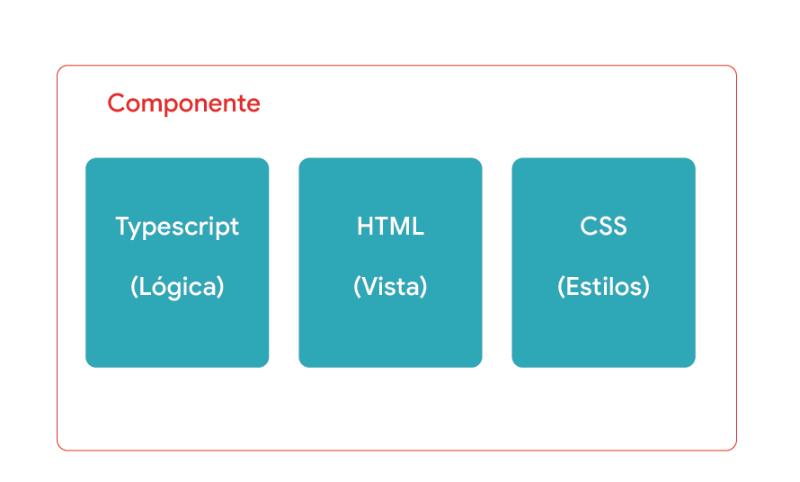

# Práctica 9. Creación de Componentes en Angular.

## Objetivo de la práctica:
Al finalizar la práctica, serás capaz de:

- Conocer qué es Angular y su papel en el desarrollo de aplicaciones web.

## Objetivo visual:



## Duración aproximada:

- 60 minutos.

## Tabla de ayuda:

| Requisito | Descripción|
| --- | --- |
| Navegador Web | Navegador web como Chrome, Firefox, Safari. |
| Editor Código | Visual Studio Code. |
| Live Preview | Extension "Live Preview" instalada en Visual Studio Code. |
| Node.js | Node.js instalado en el S.O.|
| Lenguaje TypeScript | Lenguaje instalado en el S.O.|
| Framework Angular | Angular instalado en el S.O.|
| Terminal | Acceso a la terminal de comandos del sistema. |

## Instrucciones:

### Tarea 1. Crear un Proyecto en Angular que defina un componente básico.

**Paso 1.** Crea un nuevo proyecto Angular.

Antes de crear un componente, necesitamos un proyecto Angular. Si no tienes uno, puedes crear un nuevo proyecto utilizando Angular CLI (Command Line Interface). Si ya tienes un proyecto existente, puedes omitir este paso.

**Opcional: Paso 2.** Instala Angular CLI (si aún no lo tienes instalado):

    npm install -g @angular/cli

**Paso 3.** Crea un nuevo proyecto Angular:

```
ng new my-angular-app
```

`my-angular-app` es el nombre del proyecto. Puedes elegir cualquier nombre.

- Navegar al directorio del proyecto:

    cd my-angular-app

**Paso 4.** Crea un nuevo componente.
- Ahora que tenemos un proyecto Angular, podemos crear un nuevo componente llamado `GreetingComponent`.
- Usa Angular CLI para generar el componente:

        ng generate component greeting

- Esto creará una carpeta llamada greeting dentro del directorio `src/app/` y generará cuatro archivos principales:

`greeting.component.ts`: Archivo de TypeScript que contiene la lógica del componente.

`greeting.component.html`: Archivo de plantilla HTML para definir la vista del componente.

`greeting.component.css`: Archivo de estilo para el componente.

`greeting.component.spec.ts`: Archivo de pruebas para el componente.

**Paso 5.** Configura el componente.
- Vamos a modificar el componente para que muestre un mensaje de saludo.

- Modificar el archivo `greeting.component.ts`:

    - Este archivo contiene la clase del componente. 
    - Modificaremos la clase para incluir una propiedad que contenga el mensaje de saludo.

### Angular
```
import { Component } from '@angular/core';

@Component({
  selector: 'app-greeting',   // El selector para usar este componente en otras plantillas
  templateUrl: './greeting.component.html',
  styleUrls: ['./greeting.component.css']
})
export class GreetingComponent {
  mensaje: string;

  constructor() {
    this.mensaje = '¡Hola, bienvenido a mi componente Angular!';
  }
}
```
**Explicación:**

- Usamos el decorador `@Component` para definir metadatos del componente, como su selector `(app-greeting)`, la plantilla HTML y el archivo de estilo.
- Dentro de la clase `GreetingComponent` definimos una propiedad mensaje que contiene un mensaje de saludo.
- En el constructor de la clase, inicializamos el mensaje.
- Modificar el archivo `greeting.component.html`.

**Paso 6.** Crea este archivo que contiene la plantilla HTML que define la vista del componente.

### HTML
```
<div class="greeting-container">
  <h1>{{ mensaje }}</h1>
</div>
```

**Explicación:**

- Utilizamos interpolación `({{ mensaje }})` para mostrar el valor de la propiedad mensaje en la plantilla. Angular actualizará automáticamente la vista si el valor de mensaje cambia.
- Modificamos el archivo `greeting.component.css` (opcional):

    - Puedes agregar estilos básicos para mejorar la apariencia del componente.

### CSS
```
.greeting-container {
  text-align: center;
  margin-top: 50px;
}

h1 {
  color: #5a5a5a;
}
```

**Explicación:**

- Definimos un contenedor con la clase `greeting-container` y lo centramos con `text-align: center`.
- Aplicamos color al texto del encabezado `<h1>`.

**Paso 7.** Incluye el componente en el Módulo Principal.

- Para usar el componente en nuestra aplicación debemos asegurarnos de que esté declarado en un módulo de Angular. Generalmente, esto se hace en el módulo raíz de la aplicación `(AppModule)`.

- Abre el archivo `app.module.ts`:
    - Este archivo está en el directorio `src/app/`.
    - Agrega el `GreetingComponent` a las declaraciones.

### Angular
```
import { NgModule } from '@angular/core';
import { BrowserModule } from '@angular/platform-browser';

import { AppComponent } from './app.component';
import { GreetingComponent } from './greeting/greeting.component'; // Importar el componente

@NgModule({
  declarations: [
    AppComponent,
    GreetingComponent // Declarar el componente
  ],
  imports: [
    BrowserModule
  ],
  providers: [],
  bootstrap: [AppComponent]
})
export class AppModule { }
```

**Explicación:**

- Importamos `GreetingComponent` desde su archivo correspondiente.
- Añadimos `GreetingComponent` al array `declarations`, lo que le permite ser usado en plantillas de la aplicación.

**Paso 8.** Usa el componente en la aplicación.
    
Ahora, vamos a utilizar `GreetingComponent` dentro de la plantilla principal de la aplicación.

- Modifica el archivo `app.component.html`:

    - Este archivo se encuentra en `src/app/` y es la plantilla del componente raíz de la aplicación.

### HTML
```
<h2>Componente Principal de la Aplicación</h2>
<app-greeting></app-greeting> <!-- Usando el componente Greeting -->
```

**Explicación:**

- Usamos el `selector app-greeting` definido en `GreetingComponent` para incluir el componente de saludo dentro de la plantilla principal.

**Paso 9.** Ejecuta la Aplicación.

- Finalmente, ejecuta tu aplicación Angular para ver el componente en acción.

- Inicia el servidor de desarrollo:

        ng serve

- Este comando compilará el proyecto y lo servirá en un servidor de desarrollo. De forma predeterminada, la aplicación estará disponible en: http://localhost:4200/.

    - Abre un navegador web y navega a: http://localhost:4200/:
    - Deberías ver el mensaje de saludo definido en `GreetingComponent`.

**Resumen del programa completo.**
En este ejemplo hemos cubierto los siguientes pasos para crear y usar un componente básico en Angular:

- Crea un proyecto Angular utilizando Angular CLI.
- Genera un nuevo componente (GreetingComponent).
- Configura el componente modificando los archivos `greeting.component.ts`, `greeting.component.htm` y `greeting.component.css`.
- Incluye el componente en el módulo principal (AppModule).
- Usa el componente en la plantilla principal de la aplicación (app.component.html).
- Ejecuta la aplicación y visualiza el resultado.

### Resultado esperado:

    Salida: 

    ¡Hola, bienvenido a mi componente Angular!

## [Índice:](../README.md)<br>
## [Práctica 8. Manejando Objetos con TypeScript.](../ApéndiceA/README.md)<br>
