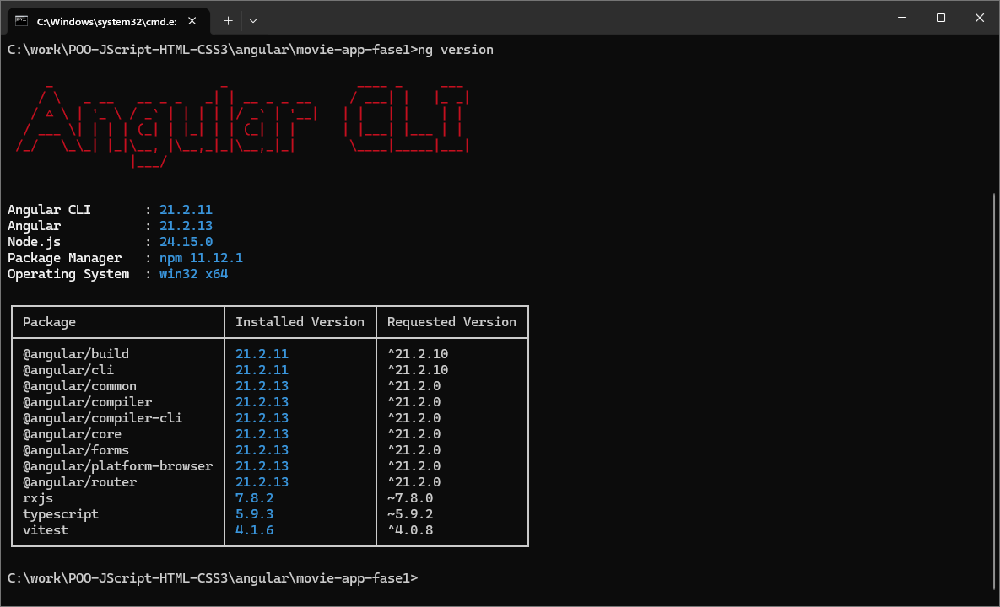
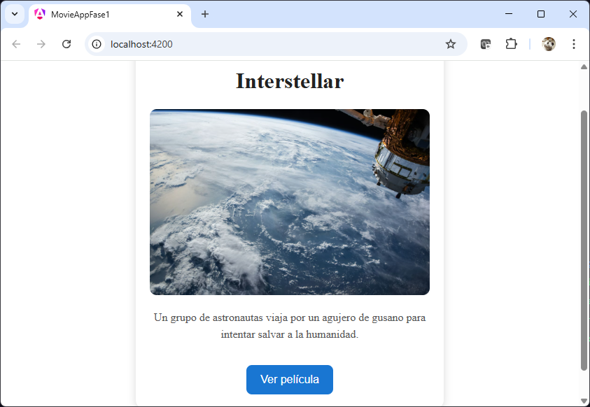

# FASE 1 — Mi primera pantalla Angular

<br/>

## Objetivo

Construir la primera pantalla Angular moderna usando:

* standalone components
* template HTML
* interpolación
* property binding
* estilos básicos
* Angular CLI

## Frase corta

* Angular ya puede renderizar interfaces dinámicas.


<br/><br/>

## 1. Crear el proyecto

### Instalar Angular CLI 

Solo en el caso de que aún no se tenga Angular CLI, se sugiere sea Angula 17+

```bash
node --version

npm --version

code --version

ng --version

npm install -g @angular/cli

ng version

```

<br/><br/>

## Crear el proyecto

```bash
ng new movie-app-fase1
```

Seleccionar:

```text
Would you like to use SSR? → No
Which stylesheet format? → CSS
```

### **Recomendación**

Aún no uses ninguna IA

<br/><br/>

## Entrar al proyecto

```bash
cd movie-app-fase1
```

<br/><br/>


## Ejecutar Angular

```bash
ng serve
```

Abrir:

```text
http://localhost:4200
```

<br/><br/>

## 2. Limpiar el proyecto

Eliminar TODO el contenido de:

```text
src/app/app.html
```

<br/><br/>


# 3. Código del componente principal

Archivo:

```text
src/app/app.ts
```

<br/>

Reemplazar, o de preferencia solo aplicar cambios al código de la clase,
no tocar los decoradores, por lo lo siguiente:

```typescript
import { Component } from '@angular/core';

@Component({
  selector: 'app-root',
  standalone: true,
  imports: [],
  templateUrl: './app.html',
  styleUrl: './app.css',
})
export class App {

  titulo = 'Interstellar';

  descripcion =
    'Un grupo de astronautas viaja por un agujero de gusano para intentar salvar a la humanidad.';

  imagen =
    'https://images.unsplash.com/photo-1446776811953-b23d57bd21aa?q=80&w=1200&auto=format&fit=crop';

  botonTexto = 'Ver película';

}
```

<br/><br/>

# 4. Template HTML

Archivo:

```html
src/app/app.html
```

<br/><br/>

Código:

```html
<div class="contenedor">

  <h1>{{ titulo }}</h1>

  

  <p>
    {{ descripcion }}
  </p>

  <button>
    {{ botonTexto }}
  </button>

</div>
```

<br/><br/>


# 5. Estilos CSS

Archivo:

```css
src/app/app.css
```

<br/>

Código:

```css
body {
  margin: 0;
  font-family: Arial, Helvetica, sans-serif;
}

.contenedor {
  width: 400px;
  margin: 40px auto;
  padding: 20px;
  background-color: #ffffff;
  border-radius: 12px;
  box-shadow: 0 4px 12px rgba(0,0,0,0.15);
  text-align: center;
}

h1 {
  color: #222;
}

img {
  width: 100%;
  border-radius: 10px;
}

p {
  color: #555;
  line-height: 1.5;
}

button {
  margin-top: 16px;
  background-color: #1976d2;
  color: white;
  border: none;
  border-radius: 8px;
  padding: 12px 20px;
  cursor: pointer;
  font-size: 16px;
}

button:hover {
  background-color: #1259a7;
}
```

<br/><br/>

# 6. Resultado visual esperado

La aplicación mostrará:

* título de película
* imagen grande
* descripción
* botón azul

Con apariencia moderna tipo card.

<br/><br/>

# 7. Conceptos Angular introducidos

## Interpolación

```html
{{ titulo }}
```

Permite mostrar datos del componente en la UI.

<br/>

## Property Binding

```html
[src]="imagen"
```

Permite conectar propiedades HTML con variables TypeScript.

<br/>

## Standalone Component

```typescript
standalone: true
```

Angular moderno sin NgModules.

<br/>

## NgModules

Un NgModule es una clase decorada con `@NgModule` que actúa como un contenedor para organizar la aplicación en bloques lógicos y cohesivos. Agrupa componentes, directivas, pipes y servicios relacionados, facilitando el mantenimiento, la reutilización del código y la carga diferida (lazy loading). 

<br/><br/>

## 8. Comentarios  

### 1. Angular separa:

* lógica → TypeScript
* interfaz → HTML
* estilos → CSS

<br/><br/>

### 2. El componente controla la pantalla

```typescript
titulo = 'Interstellar';
```

El HTML consume esa información, a través del concepto conocido como **Interpolación**

<br/><br/>

### 3. Angular actualiza automáticamente la UI

Si cambia el valor:

```typescript
titulo = 'Batman';
```

La pantalla cambia automáticamente.

<br/><br/>

## 9. Errores comunes cuando iniciamos

## Error 1

Olvidar:

```typescript
standalone: true
```

<br/><br/>

## Error 2

Escribir:

```html
{ titulo }
```

en lugar de:

```html
{{ titulo }}
```

<br/><br/>

## Error 3

Usar:

```html
src="{{ imagen }}"
```

Conectar correctamente los atributos HTML con las propiedades de la clase en TypeScript.

<br/>

```html

```

Aquí:

* src es un atributo en HTML
* imagen es una variable TypeScript

Angular enlaza ambos automáticamente usando `[atributo]="propiedad"`

<br/><br/>

## Error 4

No guardar archivos y pensar que Angular falló.

<br/><br/>


## Resultado Esperado

<br/><br/>



<br/><br/>



<br/><br/>

## Tabla de ayuda

# Tabla de ayuda — FASE 1 Angular

| Concepto            | ¿Para qué sirve?                                    | Ejemplo                                   |
| ------------------- | --------------------------------------------------- | ----------------------------------------- |
| `ng new`            | Crear un nuevo proyecto Angular                     | `ng new movie-app-fase1`                  |
| `ng serve`          | Levantar el servidor local de Angular               | `ng serve`                                |
| `Component`         | Crear una pantalla o sección reutilizable           | `App`                                     |
| `standalone: true`  | Crear componentes modernos sin NgModules            | `standalone: true`                        |
| `templateUrl`       | Indicar el archivo HTML del componente              | `templateUrl: './app.html'`               |
| `styleUrl`          | Indicar el archivo CSS del componente               | `styleUrl: './app.css'`                   |
| Interpolación       | Mostrar variables en HTML                           | `{{ titulo }}`                            |
| Property Binding    | Conectar propiedades HTML con TypeScript            | `[src]="imagen"`                          |
| Variable TypeScript | Guardar datos del componente                        | `titulo = 'Interstellar'`                 |
| HTML Template       | Definir la interfaz visual                          | `app.html`                                |
| CSS                 | Aplicar estilos visuales                            | `button { background-color: blue; }`      |
| Selector            | Nombre de la etiqueta del componente                | `selector: 'app-root'`                    |
| Angular CLI         | Herramienta para crear y ejecutar proyectos Angular | `ng serve`                                |
| `imports: []`       | Importar componentes/directivas/pipes               | `imports: []`                             |
| `alt` en imágenes   | Texto alternativo para accesibilidad                | `[alt]="titulo"`                          |
| Evento hover CSS    | Cambiar apariencia al pasar el mouse                | `button:hover`                            |
| Live Reload         | Actualización automática al guardar archivos        | Angular recarga la página automáticamente |
| Data Binding        | Sincronizar datos entre TS y HTML                   | `{{ titulo }}` y `[src]="imagen"`         |
| TypeScript          | Lenguaje usado por Angular                          | `titulo = 'Interstellar'`                 |
| Angular moderno     | Angular basado en standalone components y signals   | Angular 17+                               |


<br/><br/>

## Referencias adicionales 

### Documentación oficial Angular

* [Angular Official Documentation](https://angular.dev)
* [Angular CLI Overview](https://angular.dev/tools/cli)
* [Angular Components Guide](https://angular.dev/guide/components)
* [Angular Templates Guide](https://angular.dev/guide/templates)
* [Angular Binding Guide](https://angular.dev/guide/templates/binding)

<br/><br/>

### Conceptos HTML/CSS relacionados

* [MDN HTML Basics](https://developer.mozilla.org/en-US/docs/Learn/Getting_started_with_the_web/HTML_basics)
* [MDN CSS Basics](https://developer.mozilla.org/en-US/docs/Learn/Getting_started_with_the_web/CSS_basics)
* [MDN img Element](https://developer.mozilla.org/en-US/docs/Web/HTML/Element/img)
* [MDN button Element](https://developer.mozilla.org/en-US/docs/Web/HTML/Element/button)

<br/><br/>

### TypeScript

* [TypeScript Official Website](https://www.typescriptlang.org)
* [TypeScript Handbook](https://www.typescriptlang.org/docs/handbook/intro.html)

<br/><br/>

### Node.js y npm

* [Node.js Official Website](https://nodejs.org)
* [npm Official Website](https://www.npmjs.com)

<br/><br/>

### Extensiones recomendadas para Visual Studio Code

| Extensión                | ¿Para qué sirve?                        |
| ------------------------ | --------------------------------------- |
| Angular Language Service | Autocompletado y soporte Angular        |
| Prettier                 | Formateo automático                     |
| ESLint                   | Detección de errores y buenas prácticas |
| HTML CSS Support         | Ayuda para HTML y CSS                   |
| Material Icon Theme      | Íconos visuales en proyectos            |


<br/><br/>

### Comandos útiles Angular CLI

| Comando                 | Descripción              |
| ----------------------- | ------------------------ |
| `ng new`                | Crear proyecto           |
| `ng serve`              | Ejecutar servidor local  |
| `ng generate component` | Crear componente         |
| `ng build`              | Generar build producción |
| `ng version`            | Ver versiones instaladas |

