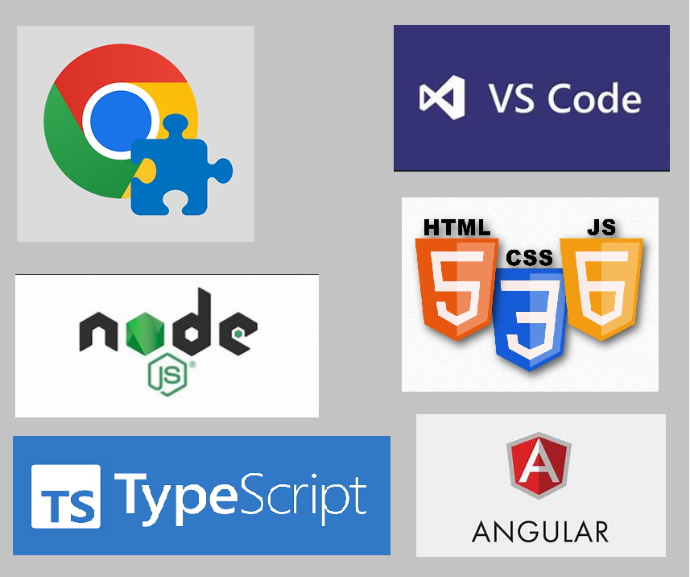
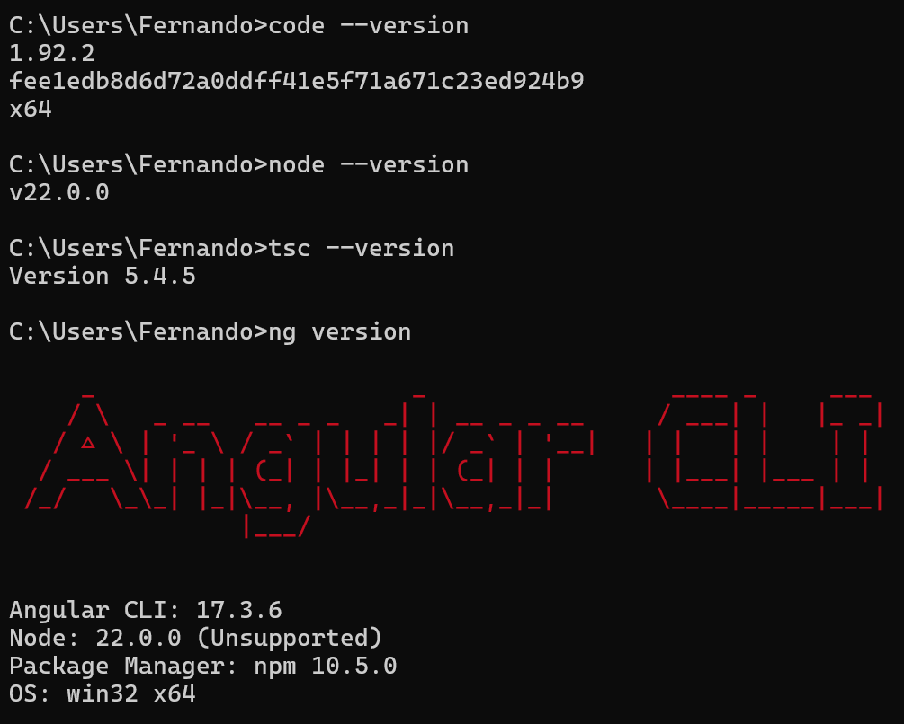

# Práctica 2. Instalación del Software de Desarrollo Web.

## Objetivo de la práctica:
Al finalizar la práctica, serás capaz de:

- Conocer qué herramientas se utilizan en el desarrollo web.
- Aprender a descargar e instalar las herramientas de desarrollo web.

## Objetivo visual:
Herramientas para el desarrollo web: 

## Duración aproximada:
- 60 minutos.

## Tabla de ayuda:
| Requisito | Descripción|
| --- | --- |
| Navegador | Tener instalado Chrome, Firefox, Edge o Safari. |
| Herramienta de Desarrollo | Descargar e instalar Visual Studio Code. |
| Ambiente de ejecución de JavaScript | Descargar e instalar Node.js. |
| Lenguaje JavaScript | Instalar TypeScript. |
| Angular Framework | Instalar Angular. |
| Terminal | Acceso a la terminal de comandos del sistema. |

## Instrucciones:
Instala los productos para desarrollo web:
    
1. Navegadores:
    - Google Chrome.

            https://www.google.es/chrome/browser/desktop/

2. Editores de código o IDEs:
    - Visual Studio Code.
    
            https://code.visualstudio.com/

3. Entornos de ejecución y lenguajes:
    - NodeJS.

            https://nodejs.org/es/
       
    - TypeScript.

            http://www.typescriptlang.org/
      
    - Angular CLI.
      
            https://cli.angular.io/

### Tarea 1. Descripción de la tarea a realizar.
**Paso 1.** Descarga desde https://www.google.es/chrome/browser/desktop/ el instalador de Google Chrome
        e instala la última versión.

**Paso 2.** Descarga desde https://code.visualstudio.com/ Visual Studio Code e instala la última versión.

**Paso 3.** Descarga desde https://nodejs.org/es/ Node.js e instala la última versión.

- Ingresa al sitio: https://nodejs.org/es/
- Elige Windows Installer (.msi) 64 bits. 
- Descarga la versión recomendada para la mayoría de las instalaciones.
- Ejecuta el instalador.

**Paso 4.** Instala Typescript.

- Usando npm
  TypeScript está disponible como un package en el registro npm como `typescript`.
- Si estás usando Node, la forma de instalarlo es la siguiente:     

        npm install typescript --save-dev

- Puedes hacer una instalación global con el comando:

        npm install -g typescript

**Paso 5.** Instala Angular.

- Usando npm:

            npm install -g @angular/cli

### Resultado esperado:
Verifica la instalación de los productos dando los siguientes comandos en la terminal de Windows:

## [Índice:](../README.md) 
## - [Práctica 1. Creando una página web.](../Capítulo1/README.md) 
## - [Práctica 3. Diseñando y estructurando una página web con HTML.](../Capítulo3/README.md) 
