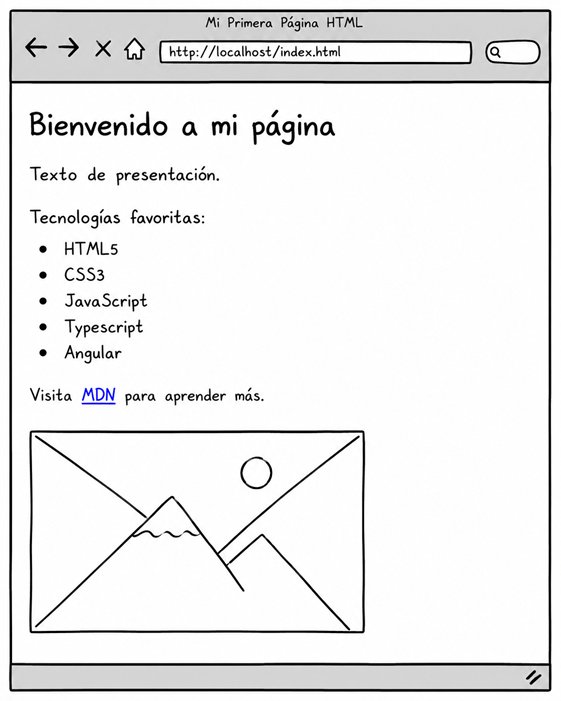
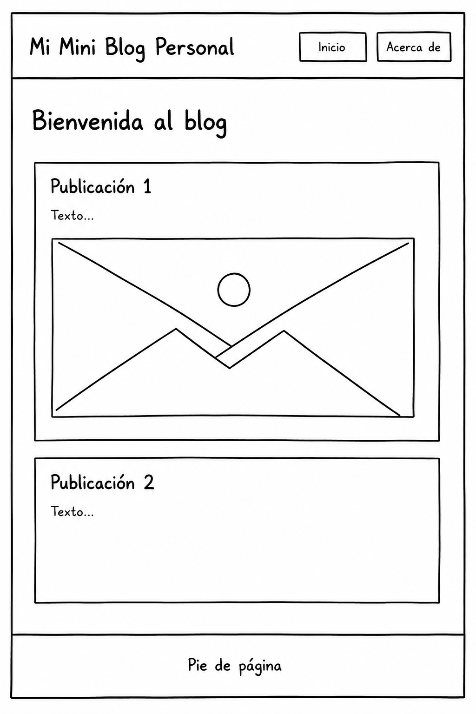
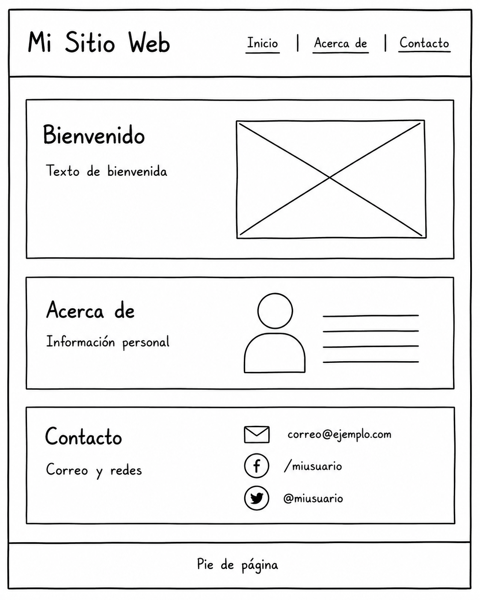
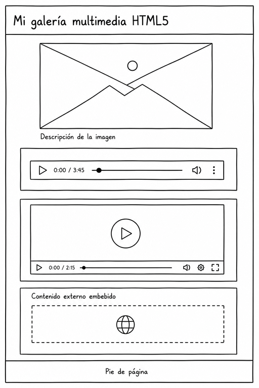
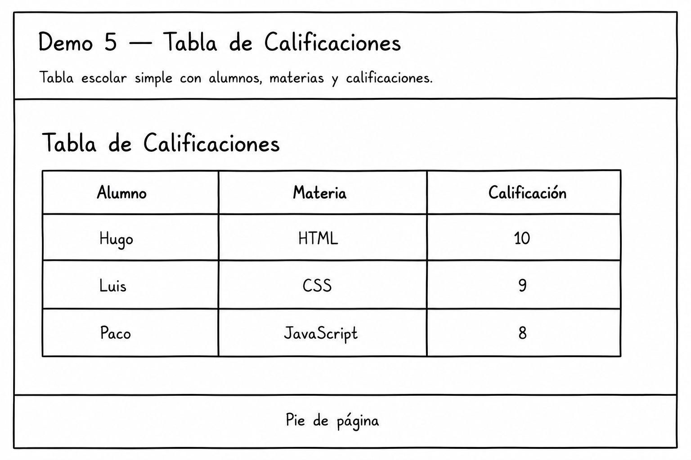
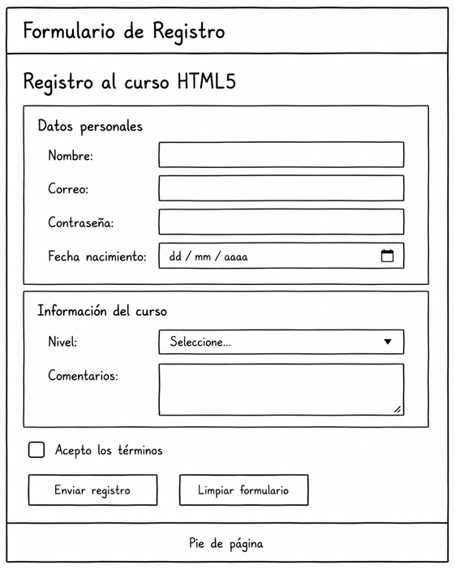
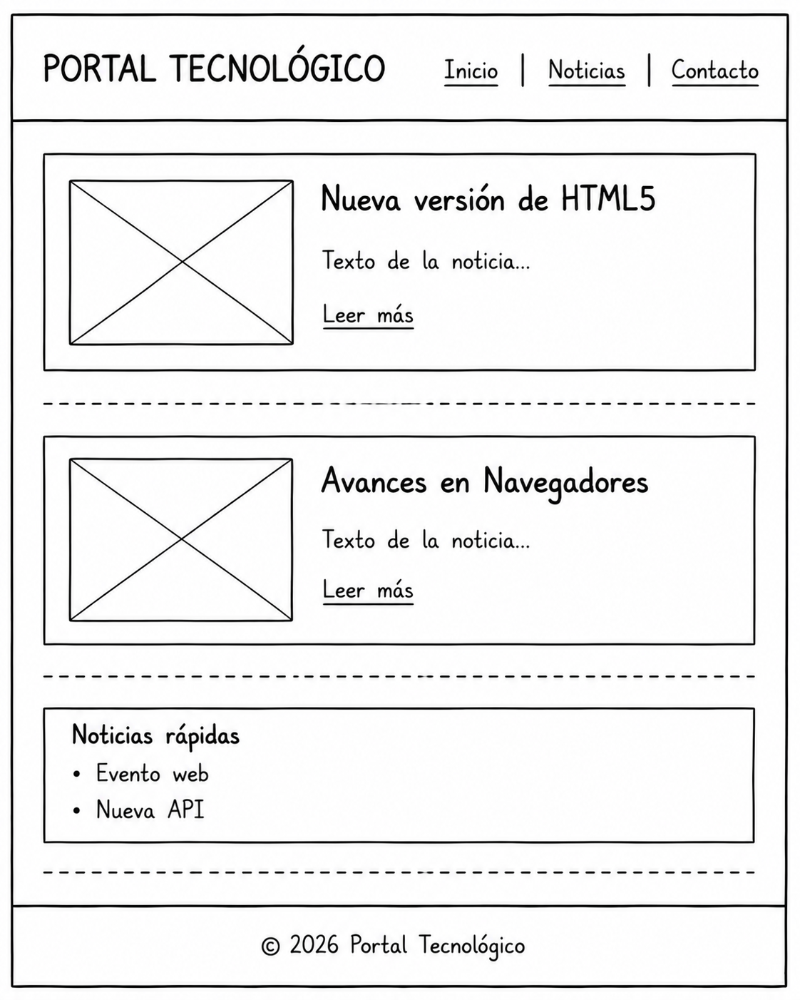
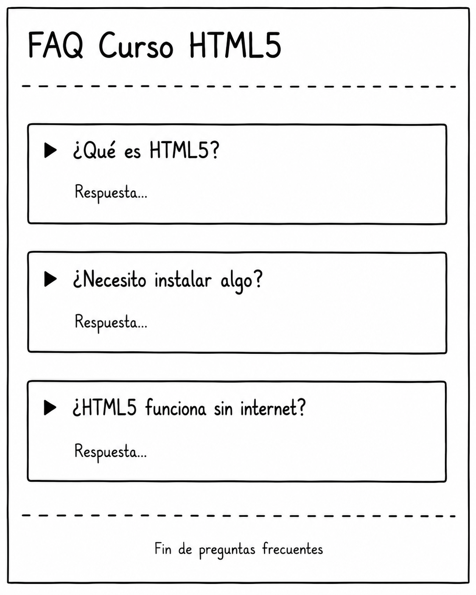

# POC — Introducción Práctica a HTML5

<br/><br/>

## Objetivo general

Construir una serie de pequeñas páginas web utilizando únicamente HTML5, con el fin de comprender cómo el navegador interpreta la estructura, contenido y semántica de una página web moderna, sin utilizar CSS ni JavaScript aún.

<br/><br/>

## Objetivos

Al finalizar estas prácticas, serás capaz de:

* Comprender la estructura básica de un documento HTML.
* Crear páginas web simples utilizando etiquetas HTML5.
* Organizar contenido mediante títulos, listas, tablas y formularios.
* Crear navegación entre páginas HTML.
* Insertar imágenes, audio y video.
* Comprender la importancia de la semántica HTML.
* Identificar cómo el navegador renderiza HTML de forma nativa.
* Reconocer etiquetas modernas de HTML5 para accesibilidad y SEO.

<br/><br/>

## Idea pedagógica 

HTML define la estructura y significado del contenido.
El navegador ya sabe interpretar HTML y aplicar estilos visuales básicos por defecto.


| Categoría      | Pregunta                                  |
| -------------- | --------------------------------------------------- |
| Estructura     | ¿Cómo nace una página?                              |
| Texto          | ¿Cómo muestro información?                          |
| Navegación     | ¿Cómo conecto páginas?                              |
| Multimedia     | ¿Cómo agrego imágenes y video?                      |
| Datos          | ¿Cómo organizo información?                         |
| Formularios    | ¿Cómo capturo datos?                                |
| Semántica      | ¿Cómo entiende Google mi página?                    |
| Interactividad | ¿Cómo agrego comportamiento moderno sin JavaScript? |

<br/><br/>

## Lista de Páginas y demos que construiremos

* Demo 1 — Mi Primera (o mi segunda página, ya estamos en el capítulo 3) Página HTML
* Demo 2 — Mini Blog Personal
* Demo 3 — Sitio Web con Navegación
* Demo 4 — Galería Multimedia HTML5
* Demo 5 — Tabla de Calificaciones
* Demo 6 — Formulario de Registro
* Demo 7 — Portal de Noticias HTML5
* Demo 8 — FAQ Interactivo sin JavaScript

<br/>
<br/>

---

<br/>
<br/>

## Demo 1 - Mi Primera Página HTML

<br/><br/>

### Objetivo

Aprender a construir una página HTML5 más completa utilizando etiquetas básicas de estructura, texto, listas, enlaces e imágenes.

<br/><br/>

### Objetivo visual

Al abrir la página en el navegador, el participante verá:

* Un título principal
* Un párrafo de bienvenida
* Una lista de tecnologías favoritas
* Un enlace hacia MDN
* Una imagen
* Una pequeña sección adicional organizada con subtítulos

Todo utilizando únicamente HTML5 y los estilos por defecto del navegador.

<br/><br/>

### Explicación breve del tema

HTML5 permite estructurar páginas web mediante etiquetas semánticas y de contenido.

En esta demo construiremos una página más completa utilizando:

* Encabezados
* Párrafos
* Listas
* Enlaces
* Imágenes
* Separadores

<br/><br/>

### Tabla de ayuda

| Etiqueta HTML | ¿Para qué sirve?                    | Ejemplo rápido             |
| ------------- | ----------------------------------- | -------------------------- |
| `<html>`      | Define el documento HTML            | `<html>`                   |
| `<head>`      | Contiene configuración de la página | `<head>`                   |
| `<title>`     | Título mostrado en la pestaña       | `<title>[Demo 1]</title>` |
| `<body>`      | Contenido visible del sitio         | `<body>`                   |
| `<h1>`        | Encabezado principal                | `<h1>Bienvenido</h1>`      |
| `<h2>`        | Subtítulo                           | `<h2>Acerca de</h2>`       |
| `<p>`         | Párrafo de texto                    | `<p>Hola mundo</p>`        |
| `<ul>`        | Lista desordenada                   | `<ul></ul>`                |
| `<li>`        | Elemento de lista                   | `<li>HTML</li>`            |
| `<a>`         | Crear enlaces                       | `<a href="">Ir al link</a>`|
| ``       | Mostrar imágenes                    | ``             |
| `<hr>`        | Línea divisora                      | `<hr/>`                     |
| `<br>`        | Salto de línea                      | `<br/>`                     |


<br/><br/>

### Descripción de la página que construiremos

Construiremos una pequeña página personal donde presentes:

* Tu nombre
* Tus tecnologías favoritas
* Un enlace útil para aprender HTML
* Una imagen relacionada con desarrollo web
* Una sección de información personal

<br/><br/>

### Estructura visual esperada

```text
Mi Primera Página HTML
--------------------------------

Bienvenido a mi página

Texto de presentación.

Tecnologías favoritas:
- HTML5
- CSS3
- JavaScript
- Typescript
- Angular

Visita MDN para aprender más.

[Imagen]

--------------------------------

Acerca de mí

Texto adicional.
```

<br/><br/>

## Bosquejo



<br/><br/>

### Instrucciones

### Tarea 1 — Crear el archivo HTML

1. Abre Visual Studio Code.

<br/>

2. Crea una carpeta llamada:

   ```text
   demo1-html5
   ```

<br/>

3. Dentro crea un archivo:

   ```text
   index.html
   ```

<br/>
<br/>

### Tarea 2 — Escribir la estructura base

Agrega la estructura mínima de HTML5.

<br/>

### Tarea 3 — Agregar encabezados y párrafos

Utiliza:

* h1
* h2
* p

para mostrar contenido.

<br/>

### Tarea 4 — Agregar una lista

Crea una lista de tecnologías favoritas usando:

* ul
* li

<br/>

### Tarea 5 — Agregar un enlace

Crea un enlace hacia MDN.

<br/>

### Tarea 6 — Agregar una imagen

Inserta una imagen utilizando la etiqueta img.

<br/>

### Tarea 7 — Ejecutar en navegador

1. Guarda el archivo.
2. Haz doble clic sobre `index.html`.
3. Observa el resultado en Chrome o Edge.

<br/>

### Código HTML completo

```html
<!DOCTYPE html>
<html lang="es">

<head>
    <meta charset="UTF-8">
    <title>[Demo 1 - HTML]</title>
</head>

<body>

    <!-- Título principal -->
    <h1>Mi Segunda Página HTML</h1>

    <hr>

    <h2>Bienvenido</h2>

    <p>
        Esta es una página HTML5 creada únicamente con etiquetas HTML, para recordar o 
        reforzar su uso
    </p>

    <p>
        Estoy aprendiendo desarrollo web paso a paso.
    </p>

    <h2>Tecnologías favoritas</h2>

    <ul>
        <li>HTML5</li>
        <li>CSS3</li>
        <li>JavaScript</li>
    </ul>

    <h2>Enlace útil</h2>

    <p>
        Visita
        <a href="https://developer.mozilla.org/es/" target="_blank">
            MDN Web Docs
        </a>
        para aprender más.
    </p>

    <h2>Imagen</h2>

    

    <hr>

    <h2>Acerca de mí</h2>

    <p>
        Me gusta aprender tecnologías web y construir páginas web.
    </p>

    <br />

    <p>
        Fin de la demo 1
    </p>

</body>

</html>
```

<br/><br/>

### Valida lo aprendido

* HTML5 funciona correctamente
* El navegador renderiza etiquetas básicas
* Puede crear estructura visual simple
* Puede insertar imágenes
* Puede crear enlaces
* Comprende la organización básica de una página web


<br/>
<br/>

### Problemas comunes

| Problema                        | Posible causa                  |
| ------------------------------- | ------------------------------ |
| La página aparece vacía         | El archivo no fue guardado     |
| La imagen no carga              | URL incorrecta                 |
| El enlace no funciona           | Error en `href`                |
| El navegador muestra texto raro | Problema de codificación UTF-8 |
| No aparece el título de pestaña | Falta `<title>`                |

<br/>
<br/>

---

<br/>
<br/>

## Demo 2 — Mini Blog Personal

<br/>
<br/>


### Objetivo

Aprender a estructurar una página HTML sencilla simulando un mini blog personal utilizando encabezados, párrafos, imágenes, enlaces y secciones semánticas.

<br/><br/>

### Objetivo visual 

El navegador mostrará:

* Un título principal del blog
* Una breve presentación del autor
* Dos publicaciones simples
* Una imagen
* Enlaces de navegación
* Un pie de página

<br/><br/>


### Explicación breve del tema

HTML5 permite estructurar contenido usando etiquetas semánticas como:

* `header`
* `main`
* `section`
* `article`
* `footer`

Estas etiquetas ayudan a organizar la información de manera clara y entendible tanto para el navegador como para otros desarrolladores.

<br/><br/>

### Tabla de ayuda

| Etiqueta HTML | ¿Para qué sirve?             | Ejemplo rápido                |
| ------------- | ---------------------------- | ----------------------------- |
| `header`      | Encabezado principal         | `<header>Título</header>`     |
| `nav`         | Menú de navegación           | `<nav><a>Inicio</a></nav>`    |
| `main`        | Contenido principal          | `<main>Contenido</main>`      |
| `section`     | Agrupa contenido relacionado | `<section>Noticias</section>` |
| `article`     | Publicación independiente    | `<article>Post</article>`     |
| `h1`          | Título principal             | `<h1>Mi Blog</h1>`            |
| `h2`          | Subtítulo                    | `<h2>Artículo</h2>`           |
| `p`           | Párrafo                      | `<p>Hola mundo</p>`           |
| `img`         | Mostrar imagen               | ``        |
| `a`           | Crear enlaces                | `<a href="#">Ir</a>`          |
| `footer`      | Pie de página                | `<footer>2026</footer>`       |


<br/><br/>

### Descripción de la página que construiremos

Construiremos una página web sencilla llamada:

**“Mi Mini Blog Personal”**

La página tendrá:

* Encabezado principal
* Menú básico
* Presentación del autor
* Dos publicaciones pequeñas
* Imagen ilustrativa
* Pie de página

<br/><br/>


### Estructura visual esperada

```text
Mi Mini Blog Personal
[Inicio] [Acerca de]

Bienvenida al blog

Publicación 1
Texto...

Imagen

Publicación 2
Texto...

Pie de página
```


<br/><br/>

## Bosquejo



<br/><br/>


### Instrucciones 

### Tarea 1 — Crear el archivo HTML

1. Abrir Visual Studio Code

2. Crear una carpeta llamada:
   `demo-mini-blog`

3. Crear un archivo llamado:
   `index.html`


<br/><br/>

### Tarea 2 — Crear la estructura básica

Agregar:

* `<!DOCTYPE html>`
* `html`
* `head`
* `body`

<br/><br/>

### Tarea 3 — Agregar el encabezado

Dentro de `body`:

* Crear un `header`
* Agregar un `h1`
* Agregar un menú usando `nav`

<br/><br/>

### Tarea 4 — Crear el contenido principal

Agregar:

* `main`
* `section`
* Dos `article`

Cada artículo tendrá:

* Un `h2`
* Un `p`

<br/><br/>

### Tarea 5 — Insertar una imagen

Agregar una imagen usando `img`.

<br/><br/>

### Tarea 6 — Agregar el pie de página

Crear un `footer` con un pequeño texto.

<br/><br/>

### Tarea 7 — Ejecutar en navegador

1. Guardar el archivo
2. Abrir `index.html`
3. Verificar el resultado visual


<br/><br/>

### Código HTML completo

```html
<!DOCTYPE html>
<html lang="es">

<head>
    <meta charset="UTF-8">
    <title>[Mini Blog Personal]</title>
</head>

<body>

    <!-- Encabezado principal -->
    <header>
        <h1>Mi Mini Blog Personal</h1>

        <nav>
            <a href="#">Inicio</a>
            <a href="#">Acerca de</a>
        </nav>
    </header>

    <!-- Contenido principal -->
    <main>

        <section>

            <article>
                <h2>Mi primera publicación</h2>

                <p>
                    Este es mi primer blog usando HTML5.
                    Estoy aprendiendo a estructurar páginas web.
                </p>
            </article>

            <article>
                <h2>Imagen favorita</h2>

                

                <p>
                    HTML permite insertar imágenes fácilmente.
                </p>
            </article>

        </section>

    </main>

    <!-- Pie de página -->
    <footer>
        <p>Demo HTML5 - Mini Blog Personal</p>
    </footer>

</body>

</html>
```

<br/><br/>

### Explicación breve del código

| Parte     | Explicación               |
| --------- | ------------------------- |
| `header`  | Contiene el título y menú |
| `nav`     | Área de navegación        |
| `main`    | Contenido principal       |
| `section` | Agrupa artículos          |
| `article` | Publicación individual    |
| `img`     | Inserta una imagen        |
| `footer`  | Pie de página             |


<br/><br/>

### Valida lo aprendido

* Crear una página HTML completa
* Organizar contenido semánticamente
* Usar encabezados y párrafos
* Insertar imágenes
* Crear enlaces básicos
* Comprender la estructura general de una página web


<br/><br/>

### Problemas comunes

| Problema                         | Posible causa                |
| -------------------------------- | ---------------------------- |
| La imagen no aparece             | URL incorrecta               |
| El navegador muestra texto raro  | Faltó `meta charset="UTF-8"` |
| Los enlaces no hacen nada        | Se usó `#` como ejemplo      |
| El archivo no abre correctamente | No se guardó como `.html`    |


<br/><br/>

---

<br/><br/>


## Demo 3 — Sitio Web con Navegación

<br/>

### Objetivo

Aprender a crear una página HTML con navegación básica entre secciones utilizando enlaces y etiquetas semánticas de HTML5.

<br/>

### Objetivo visual 

Construir una pequeña página web con:

* Un encabezado principal
* Un menú de navegación
* Varias secciones
* Enlaces internos entre partes de la página
* Un pie de página

El navegador mostrará una mini página web estructurada usando solamente HTML5.

<br/>

### Explicación breve del tema

HTML5 permite organizar contenido utilizando etiquetas semánticas como:

* `header`
* `nav`
* `section`
* `footer`

También podemos usar enlaces con la etiqueta `a` para movernos entre secciones de la misma página usando identificadores (`id`).

<br/>
<br/>

### Tabla de ayuda

| Etiqueta HTML | ¿Para qué sirve?                    | Ejemplo rápido                 |
| ------------- | ----------------------------------- | ------------------------------ |
| `header`      | Encabezado principal del sitio      | `<header>Mi sitio</header>`    |
| `nav`         | Contiene enlaces de navegación      | `<nav>...</nav>`               |
| `a`           | Crear enlaces                       | `<a href="#inicio">Inicio</a>` |
| `section`     | Agrupar contenido relacionado       | `<section>Contenido</section>` |
| `h1`          | Título principal                    | `<h1>Mi página</h1>`           |
| `h2`          | Subtítulos                          | `<h2>Noticias</h2>`            |
| `p`           | Párrafos de texto                   | `<p>Hola mundo</p>`            |
| `footer`      | Pie de página                       | `<footer>2026</footer>`        |
| `id`          | Identificador único para navegación | `<section id="contacto">`      |
| `main`        | Contenido principal                 | `<main>...</main>`             |


<br/>
<br/>


### Descripción de la página que construiremos

Crearemos un mini sitio web personal con:

* Menú superior
* Sección de inicio
* Sección “Acerca de”
* Sección de contacto
* Navegación mediante enlaces internos

<br/><br/>

### Estructura visual esperada

```text
Mi Sitio Web

Inicio | Acerca de | Contacto

Bienvenido
Texto de bienvenida

Acerca de
Información personal

Contacto
Correo y redes

Pie de página
```


<br/><br/>

## Bosquejo



<br/><br/>

### Instrucciones 

### Tarea 1

1. Crear un archivo llamado:

```text
index.html
```

<br/>

2. Agregar la estructura básica HTML5.

<br/>

3. Crear un encabezado usando `header`.

<br/>

4. Agregar un menú de navegación con enlaces.

<br/>

5. Crear las secciones principales usando `section`.

<br/>

6. Asignar identificadores (`id`) a cada sección.

<br/>

7. Agregar un pie de página con `footer`.

<br/>

8. Guardar el archivo y abrirlo en el navegador.

<br/>
<br/>

### Código HTML completo

```html
<!DOCTYPE html>
<html lang="es">
<head>
    <meta charset="UTF-8">
    <title>[Demo Navegación HTML5]</title>
</head>
<body>

    <!-- Encabezado principal -->
    <header>
        <h1>Mi Sitio Web</h1>
    </header>

    <!-- Menú de navegación -->
    <nav>
        <a href="#inicio">Inicio</a>
        <a href="#acerca">Acerca de</a>
        <a href="#contacto">Contacto</a>
    </nav>

    <!-- Contenido principal -->
    <main>

        <section id="inicio">
            <h2>Bienvenido</h2>
            <p>Esta es la página principal del sitio.</p>
        </section>

        <section id="acerca">
            <h2>Acerca de</h2>
            <p>Esta sección contiene información personal.</p>
        </section>

        <section id="contacto">
            <h2>Contacto</h2>
            <p>correo@ejemplo.com</p>
        </section>

    </main>

    <!-- Pie de página -->
    <footer>
        <p>Sitio creado con HTML5</p>
    </footer>

</body>
</html>
```

<br/><br/>

### Explicación breve del código

| Elemento         | Explicación                           |
| ---------------- | ------------------------------------- |
| `header`         | Contiene el título principal          |
| `nav`            | Muestra los enlaces de navegación     |
| `href="#inicio"` | Navega a la sección con `id="inicio"` |
| `main`           | Contiene el contenido principal       |
| `section`        | Divide la página en bloques           |
| `footer`         | Muestra información final             |

<br/>

### Valida lo aprendido

* Uso de etiquetas semánticas HTML5
* Creación de navegación básica
* Uso de enlaces internos
* Organización estructurada de contenido
* Uso de `id` para navegación

<br/><br/>

### Problemas comunes

| Problema                        | Causa común                        |
| ------------------------------- | ---------------------------------- |
| El enlace no funciona           | El `id` no coincide                |
| El archivo no abre              | Se guardó con extensión incorrecta |
| Los enlaces no navegan          | Falta el símbolo `#` en `href`     |
| El navegador muestra texto raro | Falta `UTF-8`                      |


<br/>
<br/>

---

<br/>
<br/>


## Demo 4 — Galería Multimedia HTML5

<br/>
<br/>

### Objetivo

Construir una página HTML5 que muestre una galería multimedia básica usando imagen, audio, video y contenido embebido.

<br/>
<br/>


### Objetivo visual 

Al abrir la página en el navegador, el participante verá:

* Un título principal.
* Una imagen con descripción.
* Un reproductor de audio.
* Un reproductor de video.
* Un contenido externo embebido mediante `iframe`.

<br/>
<br/>

### Pregunta pedagógica asociada

**¿Cómo puedo agregar contenido multimedia a una página web usando solo HTML5?**

<br/>
<br/>

### Explicación breve del tema

HTML5 permite insertar contenido multimedia directamente en el navegador sin usar plugins externos. Para ello se utilizan etiquetas como `img`, `audio`, `video`, `source`, `figure`, `figcaption` e `iframe`.

<br/>
<br/>

### Tabla de ayuda

| Etiqueta HTML | ¿Para qué sirve?                                | Ejemplo rápido                               |
| ------------- | ----------------------------------------------- | -------------------------------------------- |
| `img`         | Inserta una imagen en la página.                | ``       |
| `figure`      | Agrupa contenido visual con una descripción.    | `<figure>...</figure>`                       |
| `figcaption`  | Agrega una descripción a una figura.            | `<figcaption>Foto del curso</figcaption>`    |
| `audio`       | Inserta un reproductor de audio.                | `<audio controls>...</audio>`                |
| `video`       | Inserta un reproductor de video.                | `<video controls>...</video>`                |
| `source`      | Indica el archivo multimedia y su tipo.         | `<source src="audio.mp3" type="audio/mpeg">` |
| `iframe`      | Inserta otra página dentro de la página actual. | `<iframe src="pagina.html"></iframe>`        |


<br/>
<br/>

### Descripción de la página que construiremos

Construiremos una pequeña galería multimedia llamada **Mi galería HTML5**, donde se mostrará una imagen, un audio, un video y una página externa embebida.

<br/>
<br/>

### Estructura visual esperada

```text
Mi galería multimedia HTML5

[Imagen]
Descripción de la imagen

[Reproductor de audio]

[Reproductor de video]

[Contenido externo embebido]

Pie de página
```


<br/><br/>

## Bosquejo




<br/>
<br/>

### Instrucciones

1. Crea un archivo llamado `demo4-galeria-multimedia.html`.

2. Escribe la estructura base de HTML5.

3. Agrega un `header` con el título de la demo.

4. Dentro de `main`, crea una sección para la imagen.

5. Agrega una sección para el audio usando `audio` y `source`.

6. Agrega una sección para el video usando `video` y `source`.

7. Agrega una sección con un `iframe`.

8. Guarda el archivo y ábrelo en el navegador.

<br/>
<br/>


### Código HTML completo

```html
<!DOCTYPE html>
<html lang="es">
<head>
    <meta charset="UTF-8">
    <title>[Demo 4 - Galería Multimedia HTML5]</title>
</head>
<body>

    <header>
        <h1>Mi galería multimedia HTML5</h1>
        <p>Ejemplo básico de imagen, audio, video y contenido embebido.</p>
    </header>

    <main>

        <section>
            <h2>Imagen</h2>

            <figure>
                <!-- Imagen de ejemplo cargada desde Internet -->
                

                <figcaption>Logotipo de HTML5 mostrado con la etiqueta img.</figcaption>
            </figure>
        </section>

        <section>
            <h2>Audio</h2>
            <p>Reproductor de audio usando la etiqueta audio.</p>

            <audio controls>
                <source src="https://www.w3schools.com/html/horse.mp3" type="audio/mpeg">
                Tu navegador no soporta la reproducción de audio.
            </audio>
        </section>

        <section>
            <h2>Video</h2>
            <p>Reproductor de video usando la etiqueta video.</p>

            <video width="320" height="240" controls>
                <source src="https://www.w3schools.com/html/movie.mp4" type="video/mp4">
                Tu navegador no soporta la reproducción de video.
            </video>
        </section>

        <section>
            <h2>Contenido embebido</h2>
            <p>Ejemplo de una página web dentro de otra página.</p>

            <iframe 
                src="https://example.com" 
                title="Página de ejemplo"
                width="400" 
                height="250">
            </iframe>
        </section>

    </main>

    <footer>
        <p>Demo 4 — Curso HTML5</p>
    </footer>

</body>
</html>
```

<br/>
<br/>

### Explicación breve del código

La etiqueta `img` muestra una imagen. Las etiquetas `audio` y `video` agregan reproductores multimedia con controles visibles gracias al atributo `controls`. La etiqueta `source` indica el archivo que se reproducirá y su tipo. La etiqueta `iframe` permite insertar una página externa dentro del documento HTML.


<br/>
<br/>

### Valida lo aprendido

* Insertar imágenes en una página.
* Agregar texto alternativo con `alt`.
* Mostrar audio y video con controles.
* Usar `source` para indicar archivos multimedia.
* Insertar contenido externo con `iframe`.
* Agrupar imágenes con `figure` y `figcaption`.


<br/>
<br/>

### Problemas comunes

| Problema                 | Posible causa                               | Solución                                  |
| ------------------------ | ------------------------------------------- | ----------------------------------------- |
| No aparece la imagen     | La URL está mal escrita o no hay Internet.  | Revisar el valor de `src`.                |
| No se escucha el audio   | El navegador bloqueó o no cargó el archivo. | Verificar conexión y formato del archivo. |
| No se reproduce el video | Formato no compatible o URL incorrecta.     | Usar formato MP4.                         |
| El `iframe` no carga     | Algunos sitios bloquean ser embebidos.      | Probar con otra URL permitida.            |
| No aparecen controles    | Falta el atributo `controls`.               | Agregar `controls` a `audio` o `video`.   |


<br/><br/>

---

<br/><br/>

## Demo 5 — Tabla de Calificaciones


<br/>
<br/>

### Objetivo

Crear una tabla HTML sencilla para organizar información escolar usando etiquetas básicas de tablas.


<br/>
<br/>

### Objetivo visual 

El navegador mostrará una tabla con alumnos, materias y calificaciones, usando el estilo default del navegador.

<br/>
<br/>

### Pregunta pedagógica asociada

**¿Cómo organizo información en filas y columnas usando HTML?**

<br/>
<br/>

### Explicación breve del tema

En HTML, las tablas permiten mostrar datos organizados. Se usan filas para agrupar registros y columnas para separar cada dato.

<br/>
<br/>

### Tabla de ayuda

| Etiqueta HTML | ¿Para qué sirve?                 | Ejemplo rápido                      |
| ------------- | -------------------------------- | ----------------------------------- |
| `<table>`     | Crea una tabla                   | `<table>...</table>`                |
| `<thead>`     | Agrupa el encabezado de la tabla | `<thead>...</thead>`                |
| `<tbody>`     | Agrupa el contenido principal    | `<tbody>...</tbody>`                |
| `<tr>`        | Crea una fila                    | `<tr>...</tr>`                      |
| `<th>`        | Crea una celda de encabezado     | `<th>Alumno</th>`                   |
| `<td>`        | Crea una celda de datos          | `<td>Ana</td>`                      |
| `<caption>`   | Agrega un título a la tabla      | `<caption>Calificaciones</caption>` |


<br/>
<br/>

### Descripción de la página que construiremos

Construiremos una página HTML con un título principal y una tabla escolar simple. La tabla mostrará alumnos, materias y calificaciones.

<br/>
<br/>

### Lista de etiquetas HTML utilizadas

`html`, `head`, `title`, `body`, `h1`, `p`, `table`, `caption`, `thead`, `tbody`, `tr`, `th`, `td`

<br/>
<br/>

### Estructura visual esperada

```text
Demo 5 — Tabla de Calificaciones

Tabla escolar simple con alumnos, materias y calificaciones.

Tabla de Calificaciones

Alumno | Materia | Calificación
Hugo    | HTML    | 10
Luis   | CSS     | 9
Paco  | JavaScript | 8
```


<br/><br/>

## Bosquejo


<br/>
<br/>

### Instrucciones

1. Crea un archivo llamado `demo5-tabla-calificaciones.html`.
2. Escribe la estructura básica de HTML5.
3. Agrega un título principal con `<h1>`.
4. Agrega una breve descripción con `<p>`.
5. Crea una tabla con `<table>`.
6. Agrega un título a la tabla con `<caption>`.
7. Crea el encabezado con `<thead>`, `<tr>` y `<th>`.
8. Crea el cuerpo de la tabla con `<tbody>`, `<tr>` y `<td>`.
9. Guarda el archivo.
10. Ábrelo en el navegador.

<br/>
<br/>

### Código HTML completo

```html
<!DOCTYPE html>
<html lang="es">
<head>
    <meta charset="UTF-8">
    <title>[Demo 5 - Tabla de Calificaciones]</title>
</head>
<body>

    <h1>Demo 5 — Tabla de Calificaciones</h1>

    <p>Tabla escolar simple con alumnos, materias y calificaciones.</p>

    <table border="1">
        <caption>Tabla de Calificaciones</caption>

        <!-- Encabezado de la tabla -->
        <thead>
            <tr>
                <th>Alumno</th>
                <th>Materia</th>
                <th>Calificación</th>
            </tr>
        </thead>

        <!-- Cuerpo de la tabla -->
        <tbody>
            <tr>
                <td>Hugo</td>
                <td>HTML</td>
                <td>10</td>
            </tr>
            <tr>
                <td>Paco</td>
                <td>CSS</td>
                <td>9</td>
            </tr>
            <tr>
                <td>Luis</td>
                <td>JavaScript</td>
                <td>8</td>
            </tr>
        </tbody>
    </table>

</body>
</html>
```

<br/>
<br/>

### Explicación breve del código

La etiqueta `<table>` crea la tabla.
`<thead>` contiene los encabezados.
`<tbody>` contiene los datos principales.
Cada `<tr>` representa una fila.
Cada `<th>` representa un encabezado.
Cada `<td>` representa un dato.


<br/>
<br/>

### Valida lo aprendido

Se aprende a:

* Crear tablas en HTML.
* Separar encabezado y contenido.
* Organizar información en filas y columnas.
* Usar una tabla para representar datos escolares.


<br/>
<br/>

### Problemas comunes

| Problema                               | Causa posible                                  | Solución                                            |
| -------------------------------------- | ---------------------------------------------- | --------------------------------------------------- |
| La tabla no se ve como tabla           | Falta `<table>` o las filas están mal cerradas | Revisar apertura y cierre de etiquetas              |
| Los encabezados no aparecen en negrita | Se usó `<td>` en lugar de `<th>`               | Usar `<th>` para encabezados                        |
| Los datos aparecen desordenados        | Faltan celdas en alguna fila                   | Cada fila debe tener el mismo número de celdas      |
| No se ven bordes                       | El navegador no muestra bordes por default     | En esta demo se usa `border="1"` para visualizarlos |


<br/><br/>

---

<br/><br/>

## Demo 6 — Formulario de Registro

<br/>
<br/>

### Objetivo

Construir un formulario HTML5 simple para capturar datos básicos de registro.

<br/>
<br/>

### Objetivo visual

El navegador mostrará un formulario con campos de texto, correo, contraseña, fecha, lista desplegable, comentarios y botones.

<br/>
<br/>

### Pregunta pedagógica asociada

**¿Cómo capturo información del usuario usando solo HTML?**

<br/>
<br/>

### Explicación breve del tema

Los formularios permiten que el usuario escriba, seleccione o envíe información. En HTML5 se pueden crear formularios básicos sin CSS ni JavaScript, usando etiquetas como `form`, `label`, `input`, `select`, `textarea` y `button`. El elemento `form` representa una sección con controles interactivos para enviar información. ([developer.mozilla.org][1])

<br/>
<br/>

### Tabla de ayuda

| Etiqueta HTML | ¿Para qué sirve?                 | Ejemplo rápido                       |
| ------------- | -------------------------------- | ------------------------------------ |
| `form`        | Agrupa los campos del formulario | `<form></form>`                      |
| `label`       | Describe un campo                | `<label for="nombre">Nombre</label>` |
| `input`       | Captura datos cortos             | `<input type="text">`                |
| `select`      | Muestra una lista desplegable    | `<select></select>`                  |
| `option`      | Define una opción del `select`   | `<option>HTML</option>`              |
| `textarea`    | Captura texto largo              | `<textarea></textarea>`              |
| `button`      | Crea un botón                    | `<button>Enviar</button>`            |
| `fieldset`    | Agrupa campos relacionados       | `<fieldset></fieldset>`              |
| `legend`      | Título del grupo de campos       | `<legend>Datos personales</legend>`  |

<br/>
<br/>

### Descripción de la página que construiremos

Una página de registro para un curso HTML5. El usuario podrá ingresar su nombre, correo, contraseña, fecha de nacimiento, nivel de experiencia, comentarios y aceptar términos.

<br/>
<br/>

### Estructura visual esperada

```text
Formulario de Registro

Registro al curso HTML5

[Datos personales]
Nombre:           [__________]
Correo:           [__________]
Contraseña:       [__________]
Fecha nacimiento: [__________]

[Información del curso]
Nivel:            [Seleccione...]
Comentarios:      [__________]

[ ] Acepto los términos

[Enviar registro] [Limpiar formulario]
```

<br/><br/>

## Bosquejo



<br/>
<br/>

### Instrucciones

1. Crear un archivo llamado `demo6-formulario-registro.html`.

2. Escribir la estructura base de HTML5.

3. Agregar un `header` con el título de la página.

4. Crear una sección principal con `main` y `section`.

5. Agregar la etiqueta `form`.

6. Agrupar los datos personales con `fieldset` y `legend`.

7. Crear campos con `label` e `input`.

8. Usar tipos de entrada como `text`, `email`, `password` y `date`.

9. Agregar una lista desplegable con `select` y `option`.

10. Agregar un área de comentarios con `textarea`.

11. Agregar una casilla de aceptación con `input type="checkbox"`.

12. Agregar botones para enviar y limpiar el formulario.

13. Abrir el archivo en el navegador.

14. Probar la validación nativa dejando campos requeridos vacíos.


<br/>
<br/>

### Código HTML completo

```html
<!DOCTYPE html>
<html lang="es">
<head>
    <meta charset="UTF-8">
    <title>Demo 6 - Formulario de Registro</title>
</head>
<body>

    <header>
        <h1>Formulario de Registro</h1>
        <p>Demo 6 del curso HTML5</p>
    </header>

    <main>
        <section>
            <h2>Registro al curso HTML5</h2>

            <!-- El formulario agrupa los campos que llenará el usuario -->
            <form action="#" method="post">

                <fieldset>
                    <legend>Datos personales</legend>

                    <p>
                        <label for="nombre">Nombre completo:</label><br>
                        <input type="text" id="nombre" name="nombre" required>
                    </p>

                    <p>
                        <label for="correo">Correo electrónico:</label><br>
                        <input type="email" id="correo" name="correo" required>
                    </p>

                    <p>
                        <label for="password">Contraseña:</label><br>
                        <input type="password" id="password" name="password" required>
                    </p>

                    <p>
                        <label for="fecha">Fecha de nacimiento:</label><br>
                        <input type="date" id="fecha" name="fecha">
                    </p>
                </fieldset>

                <fieldset>
                    <legend>Información del curso</legend>

                    <p>
                        <label for="nivel">Nivel de experiencia:</label><br>
                        <select id="nivel" name="nivel" required>
                            <option value="">Seleccione una opción</option>
                            <option value="principiante">Principiante</option>
                            <option value="intermedio">Intermedio</option>
                            <option value="avanzado">Avanzado</option>
                        </select>
                    </p>

                    <p>
                        <label for="comentarios">Comentarios:</label><br>
                        <textarea id="comentarios" name="comentarios" rows="4" cols="40"></textarea>
                    </p>
                </fieldset>

                <p>
                    <input type="checkbox" id="terminos" name="terminos" required>
                    <label for="terminos">Acepto los términos del registro</label>
                </p>

                <p>
                    <button type="submit">Enviar registro</button>
                    <button type="reset">Limpiar formulario</button>
                </p>

            </form>
        </section>
    </main>

    <footer>
        <p>HTML5 puro, sin CSS y sin JavaScript.</p>
    </footer>

</body>
</html>
```

<br/>
<br/>

### Explicación breve del código

El formulario se crea con `form`. Los campos se agrupan con `fieldset` y se describen con `legend`. Cada campo tiene un `label` asociado mediante `for` e `id`, lo cual mejora la claridad y accesibilidad. MDN recomienda esta asociación explícita para mejorar compatibilidad con herramientas externas y tecnologías de asistencia. ([developer.mozilla.org][2])

Los campos `input` permiten capturar datos distintos según su `type`, por ejemplo texto, correo, contraseña o fecha. El elemento `input` crea controles interactivos para aceptar información del usuario. ([developer.mozilla.org][3])

<br/>
<br/>

### Valida lo aprendido

* Crear formularios básicos en HTML5.
* Asociar etiquetas `label` con campos.
* Usar tipos de `input`.
* Agrupar campos con `fieldset`.
* Crear listas desplegables con `select`.
* Usar validación HTML nativa con `required`.
* Diferenciar botones `submit` y `reset`.

<br/>
<br/>

### Problemas comunes

| Problema                            | Causa común                        | Solución                                              |
| ----------------------------------- | ---------------------------------- | ----------------------------------------------------- |
| El campo no muestra validación      | Falta `required`                   | Agregar `required` al campo                           |
| El `label` no activa el campo       | No coincide `for` con `id`         | Usar el mismo valor                                   |
| El formulario no envía datos reales | `action="#"` es solo demostrativo  | En un proyecto real se necesita una ruta del servidor |
| El correo marca error               | El texto no tiene formato de email | Escribir algo como `usuario@correo.com`               |
| El botón limpia todo                | Se usó `type="reset"`              | Es comportamiento normal del botón                    |


<br/><br/>

---

<br/><br/>


## Demo 7 — Portal de Noticias HTML5

<br/>
<br/>

### Objetivo

Aprender a estructurar una página tipo portal de noticias utilizando etiquetas semánticas de HTML5 para organizar encabezados, navegación, artículos y contenido relacionado.

<br/>
<br/>

### Objetivo visual

Construir una página simple de noticias que muestre:

* Un encabezado principal
* Un menú de navegación
* Varias noticias
* Una sección lateral
* Un pie de página

Todo utilizando únicamente HTML5 y los estilos por defecto del navegador.

<br/>
<br/>


### Pregunta pedagógica asociada

**¿Cómo organizo contenido tipo periódico o portal web usando HTML5?**


<br/>
<br/>


### Explicación breve del tema

HTML5 introdujo etiquetas semánticas que ayudan a organizar el contenido de una página web de forma más clara y estructurada.

Por ejemplo:

* `header` representa encabezados
* `nav` representa navegación
* `article` representa contenido independiente
* `section` agrupa contenido relacionado
* `aside` representa información secundaria
* `footer` representa el pie de página

Estas etiquetas ayudan a que el código sea más legible y entendible.

<br/>
<br/>


### Tabla de ayuda

| Etiqueta HTML | ¿Para qué sirve?              | Ejemplo rápido                |
| ------------- | ----------------------------- | ----------------------------- |
| `header`      | Encabezado principal          | `<header>Portal</header>`     |
| `nav`         | Menú de navegación            | `<nav>Inicio</nav>`           |
| `main`        | Contenido principal           | `<main>Contenido</main>`      |
| `section`     | Agrupar contenido relacionado | `<section>Noticias</section>` |
| `article`     | Contenido independiente       | `<article>Noticia</article>`  |
| `h1` a `h3`   | Títulos y subtítulos          | `<h2>Noticia</h2>`            |
| `p`           | Párrafos                      | `<p>Texto</p>`                |
| `aside`       | Información secundaria        | `<aside>Publicidad</aside>`   |
| `footer`      | Pie de página                 | `<footer>2026</footer>`       |
| `a`           | Enlaces                       | `<a href="#">Leer</a>`        |


<br/>
<br/>


### Descripción de la página que construiremos

Crearemos un pequeño portal de noticias con:

* Un nombre del sitio
* Un menú con enlaces
* Dos noticias principales
* Una sección lateral con noticias rápidas
* Un pie de página con derechos reservados

<br/>
<br/>


### Estructura visual esperada

```text
PORTAL TECNOLÓGICO

Inicio | Noticias | Contacto

---------------------------------

Nueva versión de HTML5
Texto de la noticia...
Leer más

---------------------------------

Avances en Navegadores
Texto de la noticia...
Leer más

---------------------------------

Noticias rápidas
- Evento web
- Nueva API

---------------------------------

© 2026 Portal Tecnológico
```

<br/><br/>

## Bosquejo



<br/>
<br/>

### Instrucciones


### Tarea 1 — Crear el archivo HTML

Crear un archivo llamado:

```text
portal-noticias.html
```


<br/>
<br/>

### Tarea 2 — Crear la estructura básica

Agregar la estructura básica de HTML5:

```html
<!DOCTYPE html>
<html>
<head>
    <title>Portal de Noticias</title>
</head>
<body>

</body>
</html>
```

<br/>
<br/>

### Tarea 3 — Agregar encabezado y navegación

1. Agregar un encabezado principal usando `header`.

2. Agregar un menú de navegación usando `nav`.

3. Agregar noticias

4. Crear el contenido principal usando `main`.

5. Agregar una sección de noticias con `section`.

6. Crear dos artículos usando `article`.

7. Agregar noticias rápidas usando `aside`.

8. Agregar un `footer` al final de la página.

<br/>
<br/>


### Código HTML completo

```html
<!DOCTYPE html>
<html lang="es">
<head>
    <meta charset="UTF-8">
    <title>Portal de Noticias</title>
</head>
<body>

    <!-- Encabezado principal -->
    <header>
        <h1>Portal Tecnológico</h1>
    </header>

    <!-- Menú de navegación -->
    <nav>
        <a href="#">Inicio</a> |
        <a href="#">Noticias</a> |
        <a href="#">Contacto</a>
    </nav>

    <hr>

    <!-- Contenido principal -->
    <main>

        <section>

            <article>
                <h2>Nueva versión de HTML5</h2>

                <p>
                    HTML5 continúa evolucionando con nuevas
                    características para desarrollo web.
                </p>

                <a href="#">Leer más</a>
            </article>

            <hr>

            <article>
                <h2>Avances en Navegadores</h2>

                <p>
                    Los navegadores modernos mejoran el soporte
                    para aplicaciones web.
                </p>

                <a href="#">Leer más</a>
            </article>

        </section>

        <hr>

        <!-- Información secundaria -->
        <aside>

            <h3>Noticias rápidas</h3>

            <p>Evento de desarrollo web este viernes.</p>

            <p>Nueva API disponible en navegadores modernos.</p>

        </aside>

    </main>

    <hr>

    <!-- Pie de página -->
    <footer>
        <p>© 2026 Portal Tecnológico</p>
    </footer>

</body>
</html>
```


<br/>
<br/>


### Explicación breve del código

| Elemento  | Explicación                    |
| --------- | ------------------------------ |
| `header`  | Contiene el título principal   |
| `nav`     | Muestra enlaces del sitio      |
| `main`    | Agrupa el contenido principal  |
| `section` | Organiza las noticias          |
| `article` | Representa cada noticia        |
| `aside`   | Muestra información secundaria |
| `footer`  | Muestra información final      |


<br/>
<br/>


### Valida lo aprendido

Al finalizar la demo, el participante será capaz de:

* Usar etiquetas semánticas HTML5
* Organizar contenido tipo portal
* Crear artículos independientes
* Separar contenido principal y secundario
* Comprender la estructura moderna de una página web


<br/>
<br/>


### Problemas comunes

| Problema                                      | Posible causa                |
| --------------------------------------------- | ---------------------------- |
| El navegador no muestra acentos correctamente | Falta `meta charset="UTF-8"` |
| Los enlaces no funcionan                      | Error en `href`              |
| Las etiquetas aparecen desordenadas           | Etiquetas sin cerrar         |
| El contenido no se separa visualmente         | Falta usar `<hr>`            |


<br/>
<br/>

---

<br/>
<br/>

## Demo 8 — FAQ Interactivo sin JavaScript

<br/>

### Objetivo

Aprender a construir una sección de preguntas frecuentes (FAQ) interactiva utilizando únicamente HTML5, aprovechando las etiquetas semánticas `<details>` y `<summary>`.


<br/>
<br/>

### Objetivo visual

El navegador mostrará una lista de preguntas.
Al hacer clic sobre cada pregunta, se desplegará automáticamente la respuesta sin usar JavaScript.

<br/>
<br/>

### Pregunta pedagógica asociada

¿Cómo puedo crear contenido interactivo en HTML5 sin utilizar JavaScript?

<br/>
<br/>

### Explicación breve del tema

HTML5 incluye etiquetas especiales para mostrar y ocultar contenido de manera nativa.

La etiqueta `<details>` crea una sección desplegable y `<summary>` representa el título visible que el usuario puede abrir o cerrar.

Esto permite crear interfaces simples e interactivas sin programación adicional.


<br/>
<br/>

### Tabla de ayuda

| Etiqueta HTML | ¿Para qué sirve?                        | Ejemplo rápido                |
| ------------- | --------------------------------------- | ----------------------------- |
| `details`     | Crea un bloque desplegable              | `<details>...</details>`      |
| `summary`     | Define el título del bloque desplegable | `<summary>Pregunta</summary>` |
| `h1`          | Título principal                        | `<h1>FAQ</h1>`                |
| `p`           | Párrafo de texto                        | `<p>Respuesta</p>`            |
| `section`     | Agrupa contenido relacionado            | `<section>...</section>`      |
| `hr`          | Inserta una línea horizontal            | `<hr>`                        |


<br/>
<br/>

### Descripción de la página que construiremos

Construiremos una pequeña página de preguntas frecuentes para un curso HTML5.

Cada pregunta podrá expandirse y contraerse directamente desde el navegador.

<br/>
<br/>

### Estructura visual esperada

```text
FAQ Curso HTML5
--------------------------------

▶ ¿Qué es HTML5?
   Respuesta...

▶ ¿Necesito instalar algo?
   Respuesta...

▶ ¿HTML5 funciona sin internet?
   Respuesta...

--------------------------------
Fin de preguntas frecuentes
```

<br/>
<br/>

## Bosquejo




<br/>
<br/>

### Instrucciones

1. Crear la estructura básica HTML5.

2. Agregar un título principal con `<h1>`.

3. Crear una sección `<section>` para agrupar las preguntas.

4. Agregar un bloque `<details>` por cada pregunta.

5. Dentro de cada `<details>`, agregar un `<summary>`.

6. Debajo del `<summary>`, agregar un párrafo `<p>` con la respuesta.

7. Guardar el archivo como:

```text
faq.html
```

8. Abrir el archivo en el navegador.

<br/><br/>

### Código HTML completo

```html
<!DOCTYPE html>
<html lang="es">
<head>
    <meta charset="UTF-8">
    <title>FAQ HTML5</title>
</head>
<body>

    <h1>Preguntas Frecuentes HTML5</h1>

    <p>Ejemplo de contenido interactivo usando solo HTML5.</p>

    <hr>

    <section>

        <!-- Pregunta 1 -->
        <details>
            <summary>¿Qué es HTML5?</summary>
            <p>
                HTML5 es la versión moderna del lenguaje HTML.
            </p>
        </details>

        <br>

        <!-- Pregunta 2 -->
        <details>
            <summary>¿Necesito instalar algo para usar HTML5?</summary>
            <p>
                No. Solo necesitas un navegador web y un editor de texto.
            </p>
        </details>

        <br>

        <!-- Pregunta 3 -->
        <details>
            <summary>¿HTML5 puede crear contenido interactivo?</summary>
            <p>
                Sí. Algunas etiquetas permiten interacción sin JavaScript.
            </p>
        </details>

        <br>

        <!-- Pregunta 4 -->
        <details>
            <summary>¿Qué hace la etiqueta details?</summary>
            <p>
                Permite mostrar y ocultar contenido desplegable.
            </p>
        </details>

    </section>

    <hr>

    <p>Fin de preguntas frecuentes.</p>

</body>
</html>
```

<br/><br/>

### Explicación breve del código

* `<details>` crea una sección desplegable.
* `<summary>` define el texto visible de la pregunta.
* El contenido dentro de `<details>` se muestra al abrirlo.
* No se utiliza JavaScript porque el navegador maneja automáticamente la interacción.

<br/><br/>

### Valida lo aprendido

Al finalizar esta demo, el participante será capaz de:

* Crear contenido interactivo usando HTML5 puro.
* Utilizar `<details>` y `<summary>`.
* Organizar preguntas frecuentes.
* Comprender capacidades nativas de HTML5.


<br/><br/>

### Problemas comunes

| Problema                             | Posible causa                         |
| ------------------------------------ | ------------------------------------- |
| No aparece el desplegable            | Falta la etiqueta `<summary>`         |
| El navegador no muestra cambios      | El archivo no fue guardado            |
| El contenido aparece siempre visible | El texto quedó fuera de `<details>`   |
| La página no abre                    | El archivo no tiene extensión `.html` |


<br/><br/>

---
