# Práctica 3. Diseñando y estructurando una página web con HTML.

## Objetivo de la práctica:
Al finalizar la práctica, serás capaz de:
- Aprender cómo se diseña una página web.
- Definir la estructura de una página.
- Explicar los elementos y atributos básicos de HTML.
- Crear y marcar correctamente una página HTML que contiene elementos de texto.
- Agregar barras de navegación y enlaces.
- Adicionar imágenes e íconos a la página.
- Crear formularios para recopilar datos y validar la entrada del usuario.

## Objetivo visual:
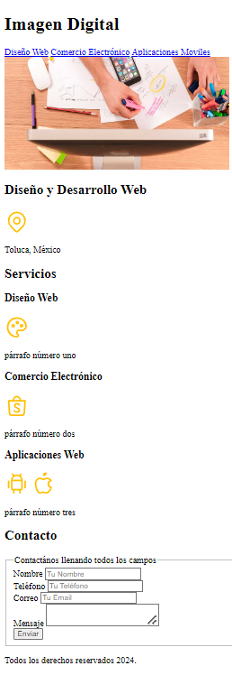

## Duración aproximada:
- 60 minutos.

## Tabla de ayuda:
| Requisito | Descripcion|
| --- | --- |
| Navegador Web | Navegador web como Chrome, Firefox, Safari. |
| Editor Código | Visual Studio Code. |
| Live Preview | Instalar la extension "Live Preview" en Visual Studio Code. |
| Terminal | Acceso a la terminal de comandos del sistema. |

## Instrucciones 

### Tarea 1. Diseñar y crear una página web.
**Paso 1.** Abre una ventana línea de comandos, cámbiate al directorio `DesarrolloWeb\capitulo3` e invoca el VSC.

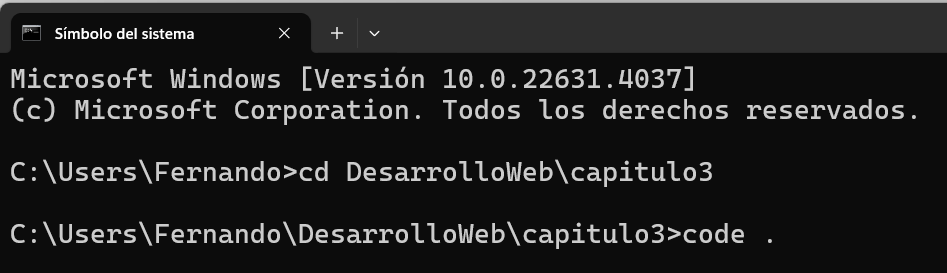

**Paso 2.** En el VSC crea un nuevo archivo `index.html` y genera la página web básica tecleando `html:5` en el área de trabajo.

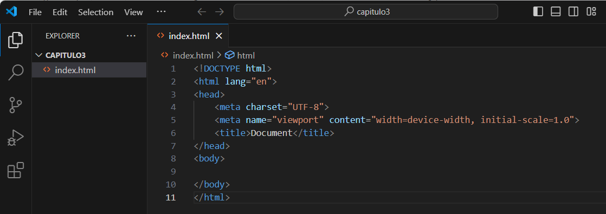

**Paso 3.** Instala la extensión `Live Preview` de Visual Studio Code.

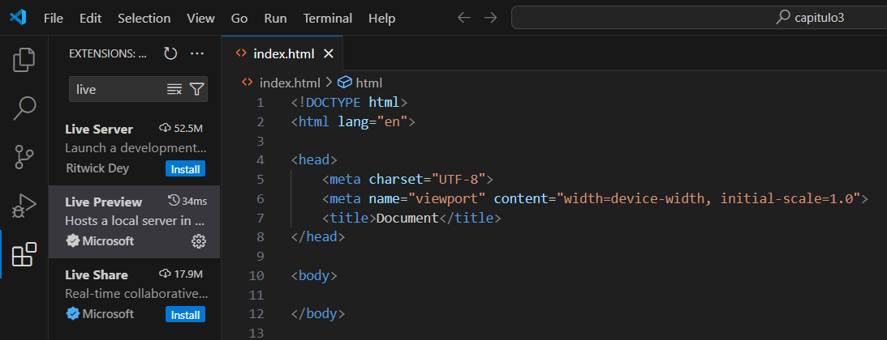

En Visual Studio Code, en la parte superior derecha, puedes darle clic al ícono de la siguiente imagen para ver en cualquier momento la presentación de la página web:
        
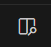

**Paso 4.** Define los TEXTOS de la página web.

- Escribe en el cuerpo de la página las siguientes etiquetas html.
- Puedes generar diferentes tipos de contenidos; para ello, dirígete a: https://loremipsum.io/es

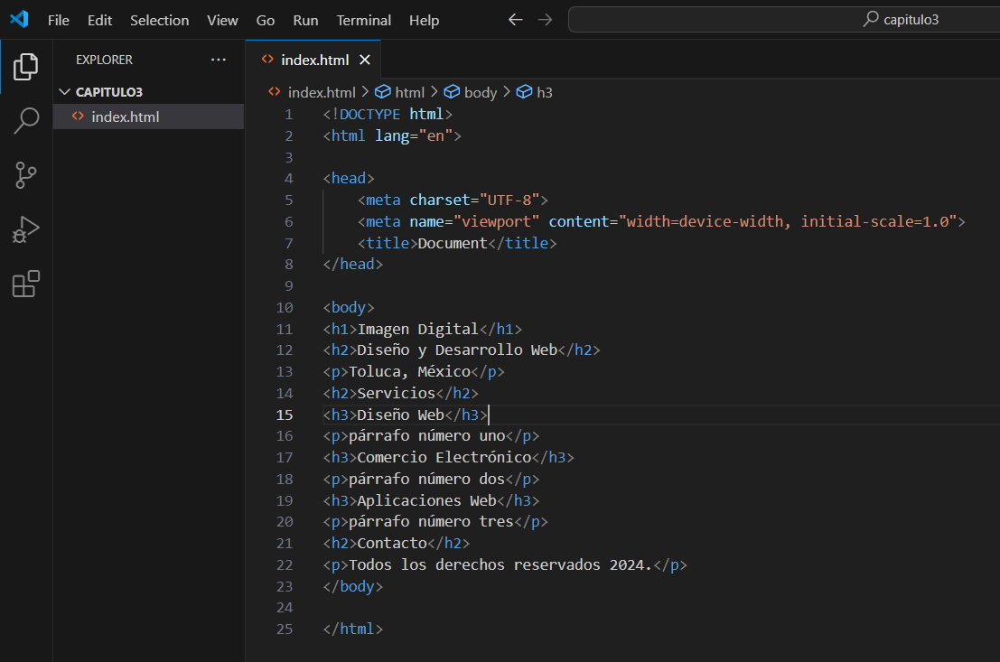  

**Paso 5.** Formatea el documento.

> [!TIP]
> Puedes usar las teclas de acceso rápido `Shift + alt + F` para dar formato html a la página.

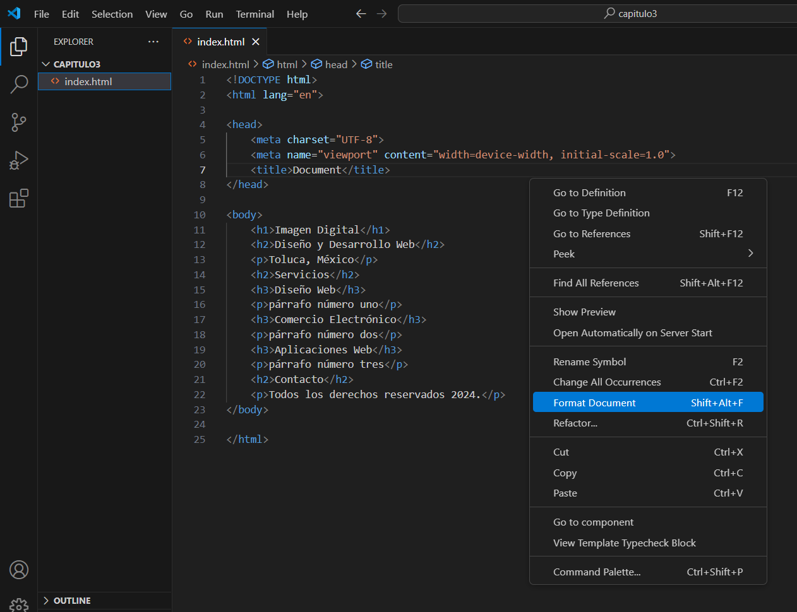

**Paso 6.** Estructura la página.

De acuerdo con las recomendaciones de agrupación, estuctura la página web en construcción:

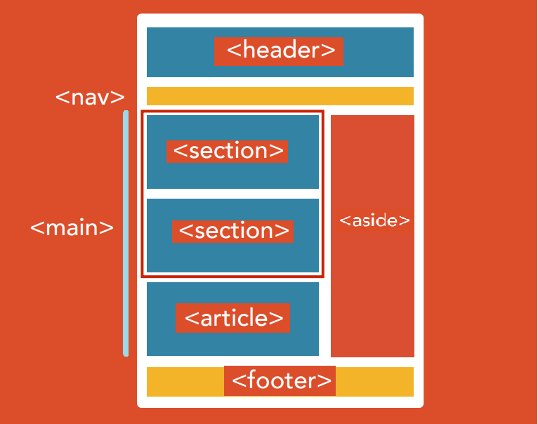

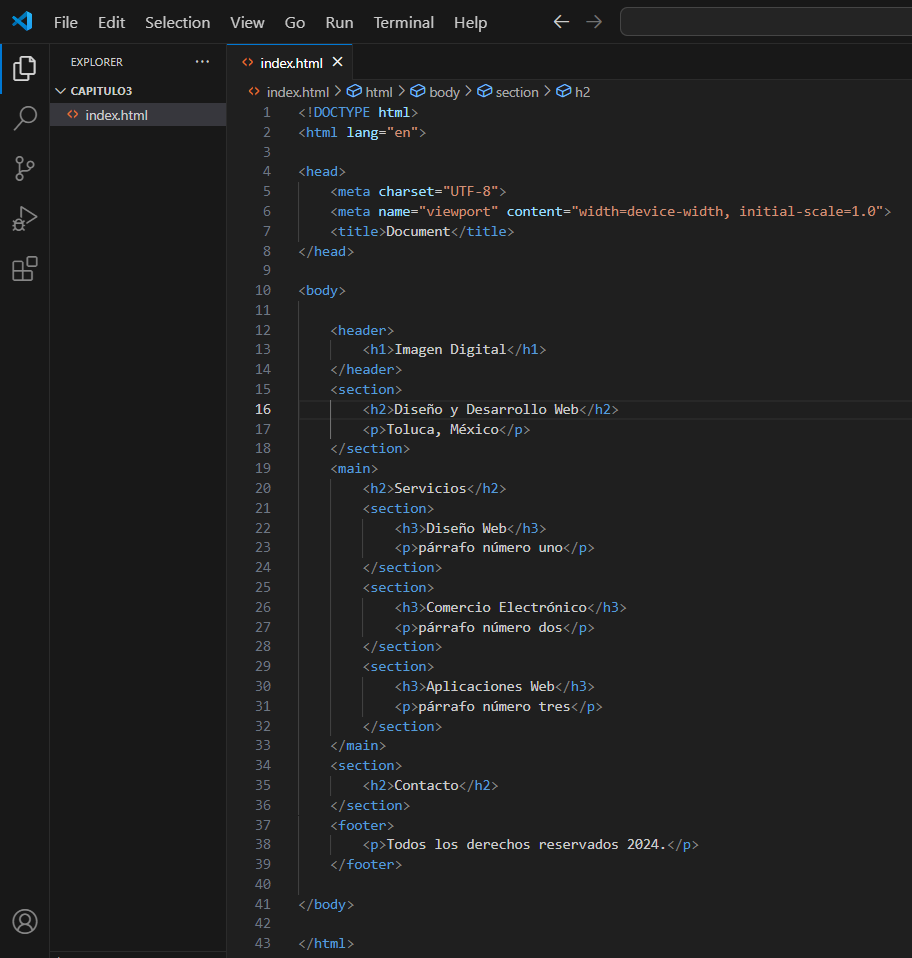

**Paso 7.** Crea los enlaces de navegación.

Usa la etiqueta:
        
        <nav></nav>
        
Y dentro de ella usa las etiquetas:

        <a href="#">contenido<a/>
        
El signo `#` significa: "aún no está decidido el enlace de la página a visitar". 
Define un enlace para la página de contacto en vez de un nivel `<h2>`, tal como se ve en las siguientes imágenes:

> [!TIP]
> Puedes usar la combinación de teclas `Shift + alt + Flecha abajo` para copiar una o más veces la línea donde está el cursor.

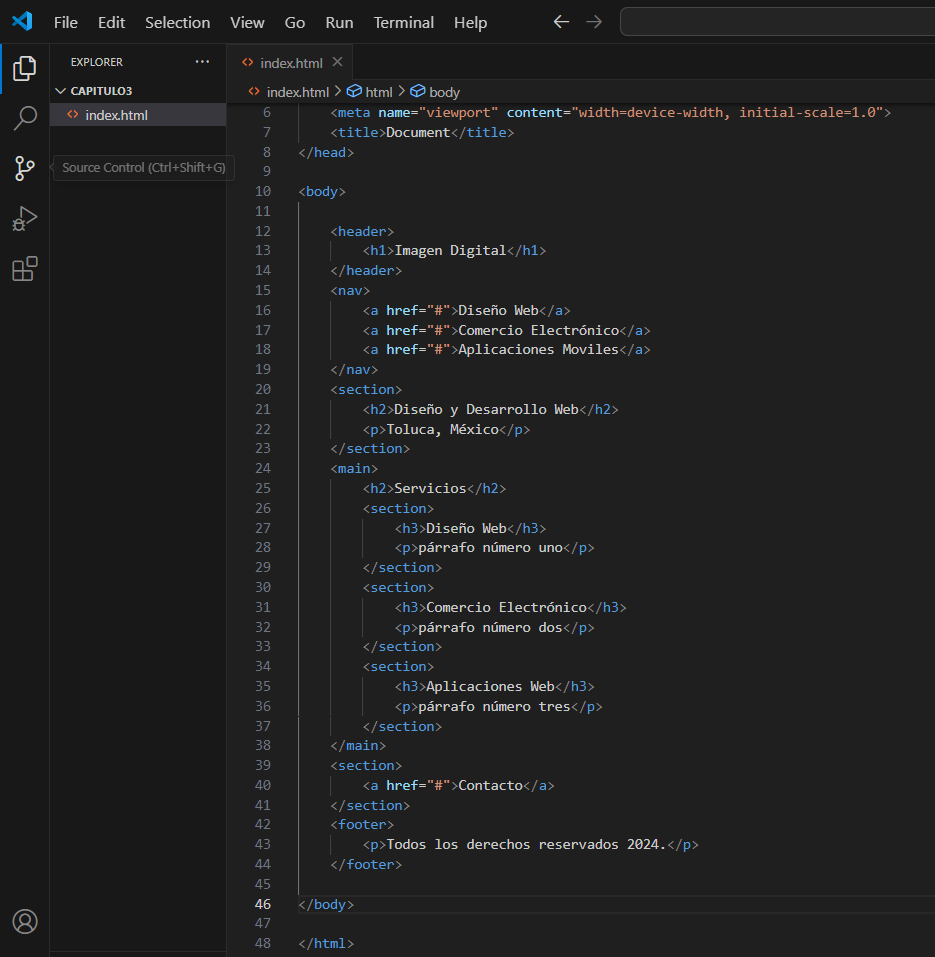

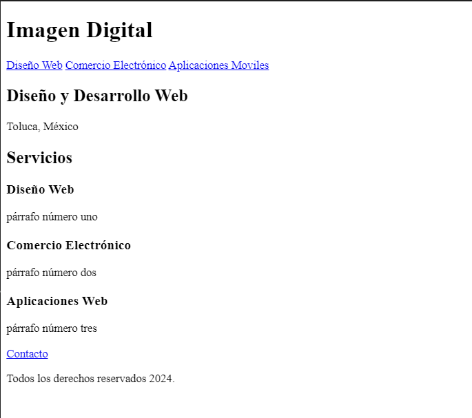

**Paso 8.** Añade las imágenes que requiera la página web. 

Existen diferentes servicios de imágenes precreadas, por ejemplo: `Tabler Icons` https://tablericons.com/, `Hero Icons` https://heroicons.com/ y `Font Awesome` https://fontawesome.com/, desde donde se pueden copiar y pegar las imágenes.

- Añade abajo de la barra de navegación una imagen de fondo usando la etiqueta:

                

- Añade un ícono desde `Table Icons`, busca uno que se llame `map-pin`, dale clic en copiar y pégalo abajo del encabezado `Diseño y Desarrollo web`.

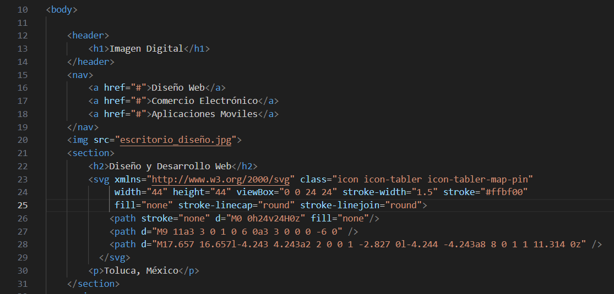

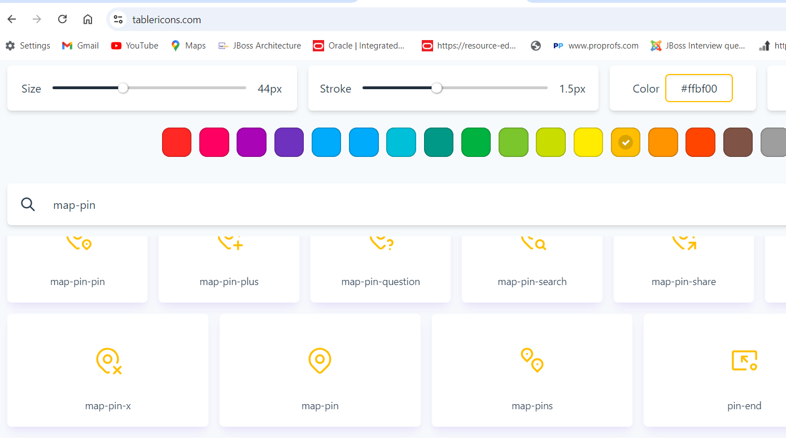

- Agrega los íconos `pallet`, `brand-android`, `brand-apple` y `brand-shopee` abajo de cada una de los encabezados de servicios.

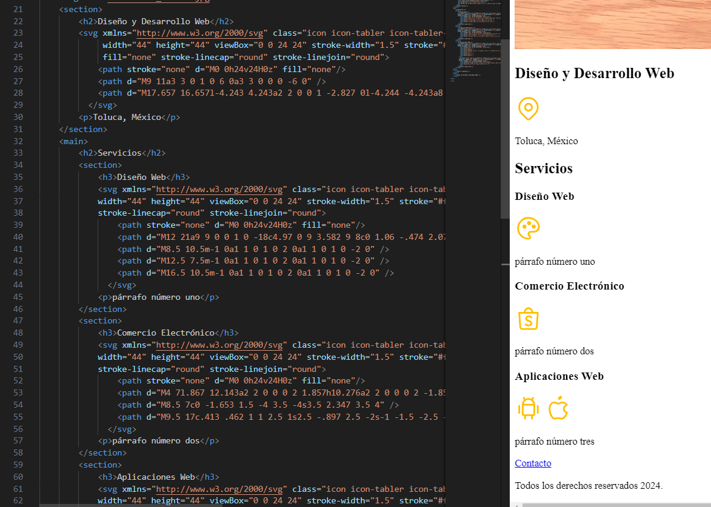

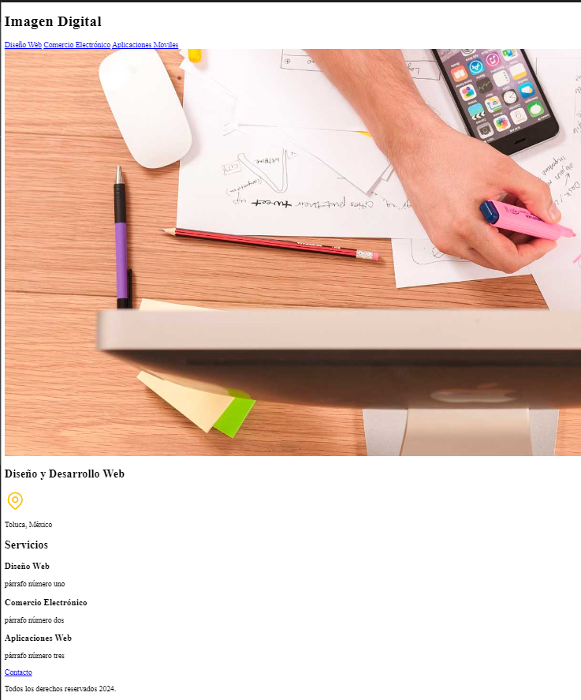

- La página al final de esta práctica se deberá ver así:

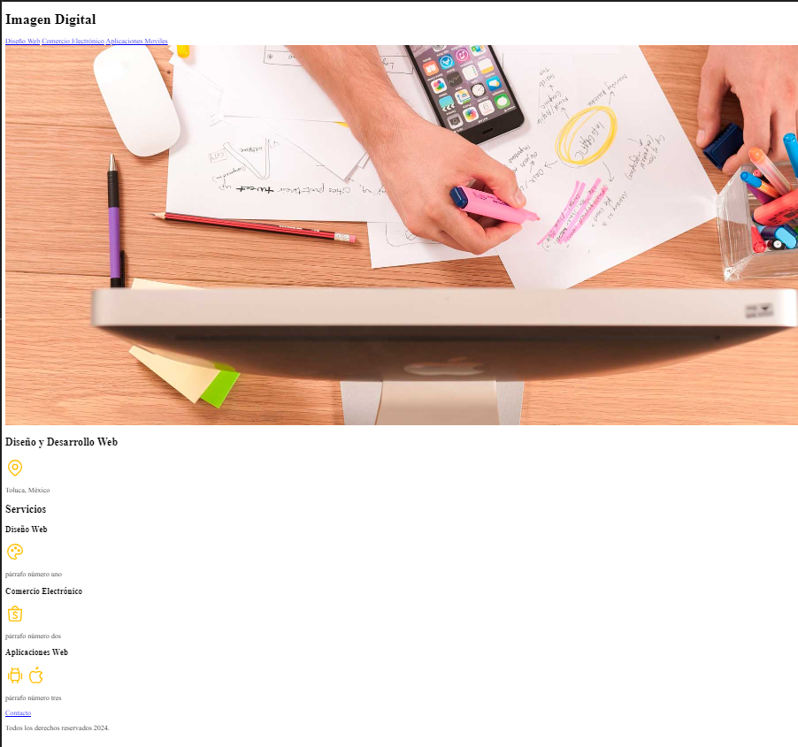

**Paso 9.** Define el formulario.

- Cambia el enlace de `Contacto` nuevamente por un encabezado tipo `<h2>`.
- Agrega la etiqueta:
  
                <form></form>
  
  después del encabezado de `Contacto`. Aquí van los campos del formulario.
- Define un grupo de campos con la etiqueta

                <fieldset></fieldset>

  y dentro de ella agrega un título con la etiqueta
  
                <legend></legend>
  
- Agrega las siguientes etiquetas por pares

                  <label>nombre de campo</label> <input type="tipo de entrada text, email, tel"/>

  de acuerdo con la información que desees capturar.
- Cada pareja `<label><input>` deberá ir dentro de una etiqueta división `

` para que aparezcan una por línea.
        
- Deberá verse tal y como se muestra en la siguiente imagen:

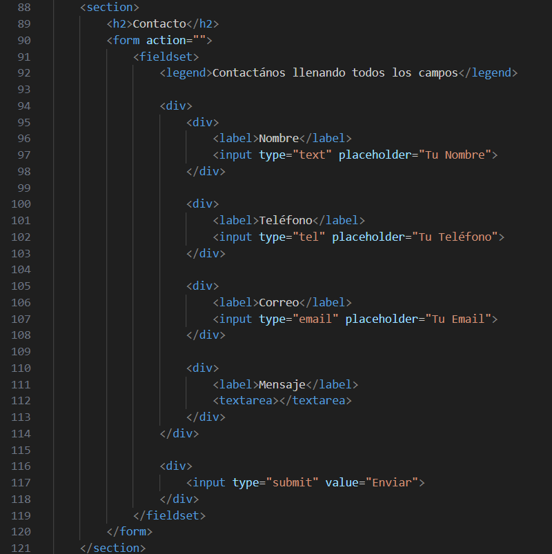

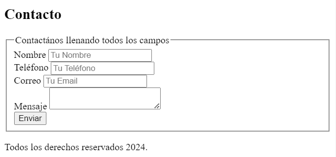
    
### Resultado esperado:

