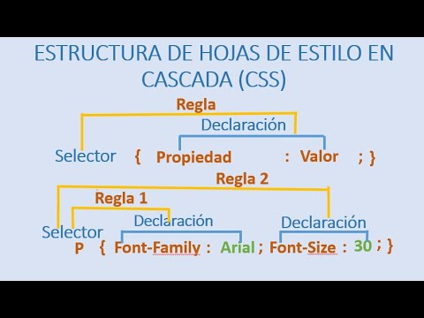
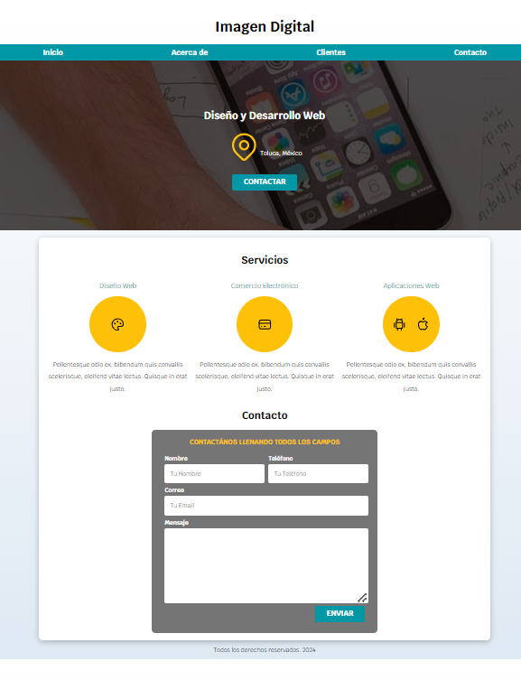

# Práctica 4. Aplicación de Hojas de Estilo en Cascada.

## Objetivo de la práctica:
Al finalizar la práctica, serás capaz de:
- Aprender a aplicar estilos a una página web.
- Conocer los selectores más usados y sus atributos.
- Aplicar diversos tipos de fuentes y colores.
- Manejar márgenes y distribución de componentes.

## Objetivo visual:

## Duración aproximada:
- 60 minutos.

## Tabla de ayuda:

| Requisito | Descripción|
| --- | --- |
| Navegador Web | Navegador web como Chrome, Firefox, Safari. |
| Editor Código | Visual Studio Code. |
| Live Preview | Instalar la extension "Live Preview" en Visual Studio Code. |
| Terminal | Acceso a la terminal de comandos del sistema. |

## Instrucciones 

### Tarea 1. Diseñar y crear una página web.

**Paso 1.** Abre una ventana linea de comandos, cambiarse al directorio DesarrolloWeb\capitulo4 e invocar el VSC.

**Paso 2.** Copia los archivos de la `Práctica 3` al directorio del `capítulo4`.
    
### Resultado esperado:

## [Índice:](../README.md) 
## - [Práctica 3. Diseñando y estructurando una página web con HTML.](../Capítulo3/README.md) 
## - [Práctica 5. Programando con JavaScript.](../Capítulo5/README.md) 
