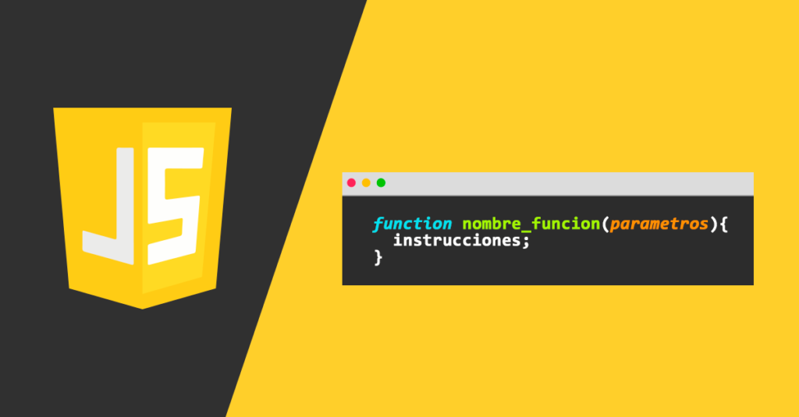

# Práctica 5. Programando con JavaScript.

<br/>
<br/>

## Objetivos
Al finalizar la práctica, serás capaz de:
- Aprender a definir variables y saber manejar arreglos.
- Usar declaraciones condicionales para controlar el flujo de ejecución.
- Saber utilizar sentencias de ciclos para procesar elementos.
- Crear y llamar a funciones básicas de JavaScript.

<br/>
<br/>


## Objetivo visual: 



<br/>
<br/>

## Duración aproximada:

- 60 minutos.

<br/>
<br/>

## Tabla de ayuda:

| Requisito | Descripción|
| --- | --- |
| Navegador Web | Navegador web como Chrome, Firefox o Safari. |
| Editor Código | Visual Studio Code. |
| Live Preview | Instalar la extension "Live Preview" en Visual Studio Code. |
| Terminal | Acceso a la terminal de comandos del sistema. |

<br/>
<br/>

## Instrucciones:

**Paso 1.** Declaración de Variables.

Para iniciar, se definieron algunas variables necesarias para nuestro programa. Utiliza una variable para almacenar el nombre de los estudiantes y otra para almacenar un arreglo de calificaciones.

<br/>
<br/>

### JavaScript
```
// Declaración de variables
let minAprobatoria = 6; // Calificación mínima para aprobar
let estudiantes = ["Ana", "Luis", "Juan", "María"]; // Arreglo con los nombres de los estudiantes
let calificaciones = [7, 4, 8, 5]; // Arreglo con las calificaciones correspondientes a cada estudiante
```

<br/>

**Explicación:**

`minAprobatoria` es una variable que almacena la calificación mínima requerida para aprobar.

`estudiantes` es un arreglo que contiene nombres de estudiantes.

`calificaciones` es un arreglo paralelo al de estudiantes, es decir, la calificación de Ana es 7, la de Luis es 4, y así sucesivamente.

<br/>

**Paso 2.** Define el Ciclo para recorrer los estudiantes.

Vamos a usar un ciclo para recorrer los estudiantes y verificar si aprobaron o no con base en su calificación.

<br/>
<br/>

### JavaScript
```
// Ciclo para recorrer el arreglo de estudiantes
for (let i = 0; i < estudiantes.length; i++) {
    // Obtener el nombre y la calificación actual
    let nombre = estudiantes[i];
    let calificacion = calificaciones[i];
    
    // Condicional para verificar si la calificación es aprobatoria
    if (calificacion >= minAprobatoria) {
        console.log(nombre + " ha aprobado con una calificación de " + calificacion);
    } else {
        console.log(nombre + " ha reprobado con una calificación de " + calificacion);
    }
}
```

<br/>

**Explicación:**

Utilizamos un `ciclo for` para recorrer todos los elementos del arreglo de estudiantes.
En cada iteración obtenemos el nombre y la calificación correspondiente usando `estudiantes[i]` y `calificaciones[i]`.
Luego, usamos una `sentencia if` para verificar si la calificación es mayor o igual a `minAprobatoria`. Si es así, imprimimos que el estudiante ha aprobado. Si no, imprimimos que ha reprobado.

<br/>
<br/>

**Paso 3.** Crea una función para agregar un nuevo estudiante y su calificación.

Podemos crear una función para agregar un nuevo estudiante y su calificación al final de los arreglos.

<br/>
<br/>

### JavaScript
```
// Función para agregar un nuevo estudiante y su calificación
function agregarEstudiante(nombre, calificacion) {
    estudiantes.push(nombre);
    calificaciones.push(calificacion);
}

// Ejemplo de uso de la función
agregarEstudiante("Carlos", 9);
```

<br/>

**Explicación:**

Definimos una función llamada `agregarEstudiante` que toma dos parámetros: el nombre del estudiante y su calificación.
Utilizamos el método `push()` para añadir el nombre y la calificación al final de los arreglos `estudiantes` y `calificaciones`.
Luego de definir la función, la usamos para agregar un nuevo estudiante, "Carlos", con una calificación de 9.

<br/>

**Paso 4.** Ejecutar el ciclo nuevamente después de agregar un nuevo estudiante.

    Podemos ejecutar el ciclo de nuevo para verificar los resultados con el nuevo estudiante agregado.

<br/>

### JavaScript
```
// Ejecutar el ciclo nuevamente
for (let i = 0; i < estudiantes.length; i++) {
    let nombre = estudiantes[i];
    let calificacion = calificaciones[i];
    
    if (calificacion >= minAprobatoria) {
        console.log(nombre + " ha aprobado con una calificación de " + calificacion);
    } else {
        console.log(nombre + " ha reprobado con una calificación de " + calificacion);
    }
}
```

<br/>

**Resumen del programa completo.**


El programa completo con todos los pasos descritos:

<br/>
<br/>

### JavaScript
```
// Declaración de variables
let minAprobatoria = 6;
let estudiantes = ["Ana", "Luis", "Juan", "María"];
let calificaciones = [7, 4, 8, 5];

// Ciclo para recorrer el arreglo de estudiantes
for (let i = 0; i < estudiantes.length; i++) {
    let nombre = estudiantes[i];
    let calificacion = calificaciones[i];
    
    if (calificacion >= minAprobatoria) {
        console.log(nombre + " ha aprobado con una calificación de " + calificacion);
    } else {
        console.log(nombre + " ha reprobado con una calificación de " + calificacion);
    }
}

// Función para agregar un nuevo estudiante y su calificación
function agregarEstudiante(nombre, calificacion) {
    estudiantes.push(nombre);
    calificaciones.push(calificacion);
}

// Agregar un nuevo estudiante
agregarEstudiante("Carlos", 9);

// Ejecutar el ciclo nuevamente
for (let i = 0; i < estudiantes.length; i++) {
    let nombre = estudiantes[i];
    let calificacion = calificaciones[i];
    
    if (calificacion >= minAprobatoria) {
        console.log(nombre + " ha aprobado con una calificación de " + calificacion);
    } else {
        console.log(nombre + " ha reprobado con una calificación de " + calificacion);
    }
}
```

<br/>
<br/>

**Explicación General.**

El programa comienza declarando variables y arreglos para almacenar los datos de los estudiantes.
Utiliza un `ciclo for` para iterar sobre los estudiantes y sus calificaciones, usando una `condición if` para determinar si cada estudiante aprueba o no.
    
Se define una función para agregar más estudiantes a la lista, lo que hace al programa extensible y flexible.
Finalmente, el ciclo se ejecuta de nuevo para mostrar los resultados después de agregar un nuevo estudiante.
Este programa demuestra el uso de variables, arreglos, ciclos y sentencias condicionales de manera clara y práctica.

<br/>
<br/>

### Resultado esperado:

    Ana ha aprobado con una calificación de 7
    Luis ha reprobado con una calificación de 4
    Juan ha aprobado con una calificación de 8
    María ha reprobado con una calificación de 5
    Ana ha aprobado con una calificación de 7
    Luis ha reprobado con una calificación de 4
    Juan ha aprobado con una calificación de 8
    María ha reprobado con una calificación de 5
    Carlos ha aprobado con una calificación de 9

<br/>
<br/>

---


## Índice

- [Práctica 4. Aplicación de Hojas de Estilo en Cascada.](../Capítulo4/README.md)
- [Práctica 6. Usando el Protocolo HTTP para acceder datos en la web.](../Capítulo6/README.md)>
