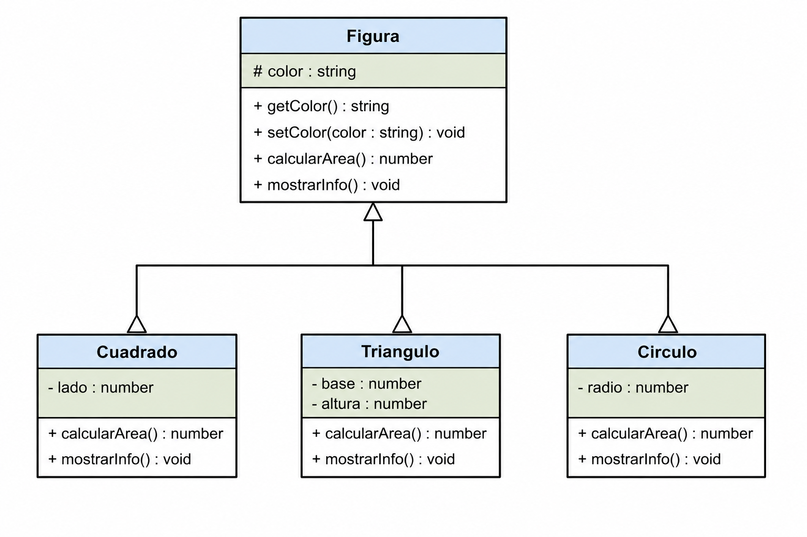

# POC/Demo — Los 4 Pilares de la Programación Orientada a Objetos en JavaScript

<br/><br/>

## Objetivo

Construir una pequeña jerarquía de clases en JavaScript para demostrar:

1. Abstracción
2. Encapsulamiento
3. Herencia
4. Polimorfismo

<br/><br/>

## Diagrama de Clases




<br/><br/>

## Pilar 1 — Abstracción

La clase `Figura` representa una idea general de figura geométrica.

No sabemos exactamente qué figura es, pero sí sabemos que:

* tiene color
* puede calcular un área
* puede mostrar información

<br/><br/>

## Pilar 2 — Encapsulamiento

Usaremos atributos privados modernos de JavaScript:

```javascript
#color
```

Solo podrán modificarse mediante métodos públicos:

```javascript
getColor()
setColor()
```

<br/><br/>

## Pilar 3 — Herencia

`Cuadrado` y `Circulo` heredarán de `Figura`.

```javascript

class Figura {}

class Cuadrado extends Figura {}

class Circulo extends Figura {}
```

<br/><br/>

## Pilar 4 — Polimorfismo

Cada clase implementará su propia versión de:

```javascript
calcularArea()
```

Aunque el método tenga el mismo nombre, el comportamiento cambia. Decimos que sobreescribimos o reescribimos el método en la subclase.

>Nota: En inglés esto es OVERWRITE, que es diferente al OVERLOAD

<br/><br/>

## Código Completo — Figura Base

```javascript
class Figura {

    // ATRIBUTO PRIVADO
    #color;

    constructor(color) {
        this.#color = color;
    }

    // GETTER
    getColor() {
        return this.#color;
    }

    // SETTER
    setColor(nuevoColor) {
        this.#color = nuevoColor;
    }

    // MÉTODO GENERAL
    calcularArea() {
        console.log("Área no definida");
    }

    mostrarInfo() {
        console.log("Color:", this.#color);
    }
}
```

<br/><br/>

## Código — Clase Cuadrado

```javascript
class Cuadrado extends Figura {

    constructor(color, lado) {
        super(color);
        this.lado = lado;
    }

    calcularArea() {
        return this.lado * this.lado;
    }

    mostrarInfo() {
        console.log("=== CUADRADO ===");
        console.log("Color:", this.getColor());
        console.log("Lado:", this.lado);
        console.log("Área:", this.calcularArea());
    }
}
```

<br/><br/>

## Código — Clase Circulo

```javascript
class Circulo extends Figura {

    constructor(color, radio) {
        super(color);
        this.radio = radio;
    }

    calcularArea() {
        return Math.PI * this.radio * this.radio;
    }

    mostrarInfo() {
        console.log("=== CÍRCULO ===");
        console.log("Color:", this.getColor());
        console.log("Radio:", this.radio);
        console.log("Área:", this.calcularArea().toFixed(2));
    }
}
```

<br/><br/>

## Código — Uso de las Clases

```javascript
const cuadrado1 = new Cuadrado("Rojo", 5);
const circulo1 = new Circulo("Azul", 3);

cuadrado1.mostrarInfo();

console.log("");

circulo1.mostrarInfo();
```


<br/><br/>

## Probando Encapsulamiento

Intentar acceder directamente al atributo privado:

```javascript
console.log(cuadrado1.#color);
```

Resultado:

```text
SyntaxError
```

Porque el atributo es privado, característica de JavaScript (ES2025 en adelante)


<br/><br/>


## Probando Polimorfismo

```javascript
const figuras = [
    new Cuadrado("Verde", 4),
    new Circulo("Rojo", 2),
    new Circulo("Verde", 8),
    new Circulo("Amarillo", 10)
];

for (const figura of figuras) {   // Bloque polimorfo
    figura.mostrarInfo();   
}
```

El programa llama el mismo método:

```javascript
mostrarInfo()
```

Pero cada clase responde diferente.

Eso es polimorfismo.

<br/><br/>

## Versión HTML + JavaScript  

## index.html

```html
<!DOCTYPE html>
<html lang="es">
<head>
    <meta charset="UTF-8">
    <title>POO en JavaScript</title>
</head>
<body>

    <h1>POO en JavaScript</h1>

    <script src="app.js"></script>

</body>
</html>
```


<br/><br/>

## app.js

```javascript
class Figura {

    #color;

    constructor(color) {
        this.#color = color;
    }

    getColor() {
        return this.#color;
    }

    setColor(nuevoColor) {
        this.#color = nuevoColor;
    }

    calcularArea() {
        console.log("Área no definida");
    }

    mostrarInfo() {
        console.log("Color:", this.#color);
    }
}


// Cuadrado
class Cuadrado extends Figura {

    constructor(color, lado) {
        super(color);
        this.lado = lado;
    }

    calcularArea() {
        return this.lado * this.lado;
    }

    mostrarInfo() {
        console.log("=== CUADRADO ===");
        console.log("Color:", this.getColor());
        console.log("Lado:", this.lado);
        console.log("Área:", this.calcularArea());
    }
}

// Círculo

class Circulo extends Figura {

    constructor(color, radio) {
        super(color);
        this.radio = radio;
    }

    calcularArea() {
        return Math.PI * this.radio * this.radio;
    }

    mostrarInfo() {
        console.log("=== CÍRCULO ===");
        console.log("Color:", this.getColor());
        console.log("Radio:", this.radio);
        console.log("Área:", this.calcularArea().toFixed(2));
    }
}

const cuadrado1 = new Cuadrado("Rojo", 5);
const circulo1 = new Circulo("Azul", 3);

cuadrado1.mostrarInfo();

console.log("");

circulo1.mostrarInfo();
```

<br/><br/>

## Desafío Final — Clase Triángulo

Agregar una nueva figura:

```text
Triangulo
```

<br/><br/>

## Requisitos

La clase debe:

* heredar de `Figura`
* tener:

  * base
  * altura
  
* sobrescribir:

  * `calcularArea()`
  * `mostrarInfo()`

<br/><br/>


# Preguntas para compartir con tus compañeros de curso

1. ¿Qué código puede reutilizar `Triangulo` gracias a la herencia?
2. ¿Por qué `#color` no puede accederse directamente?
3. ¿Qué método demuestra mejor el polimorfismo?
4. ¿Qué pasaría si `Figura` tuviera más métodos comunes?
5. ¿Por qué `super(color)` es obligatorio?
6. ¿Recuerdas algún tema de otro lenguaje sobre OOP que no vista en JavaScript?
